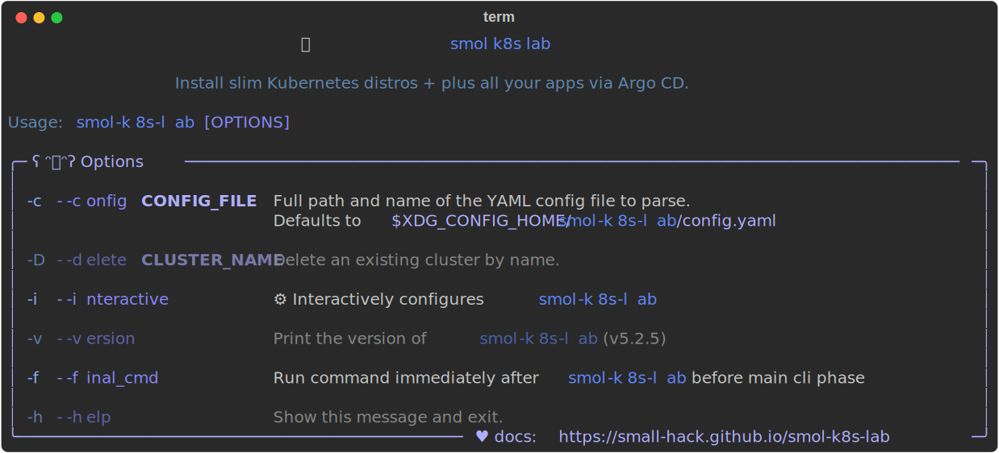

<h2 align="center">
  
smol k8s lab 🧸 <sup><sub>Now with more :squid:</sub></sup>
</h2>

<p align="center">
  <a href="https://github.com/small-hack/smol-k8s-lab/releases">
    
  </a>
</p>

A terminal based tool to install slimmer k8s distros on metal, with batteries included. Deploys [Argo CD](https://github.com/argoproj/argo-cd) by default, so you can manage your entire local testing lab from the very beginning using files in [open source git repos](https://github.com/small-hack/argocd-apps), and with the help of a very handy dashboard. Also helpful for benchmarking various [k8s distros](#supported-k8s-distributions)! 💙 Check out our video tour, if you like that sort of thing:<br></br>

<p align="center">
  <a href="https://www.youtube.com/watch?v=UdOQM9n5hyU&t=0s">
    
  </a>
</p>
<p align="center">
Here's the <a href="https://youtu.be/2E9DVJpv440?feature=shared">same video with captions.</a>
</p>


# Installation
B sure to check out our full [installation guide](https://small-hack.github.io/smol-k8s-lab/installation/), but the gist of it is `smol-k8s-lab` can be installed via `pipx` or `brew`.

## pipx
`smol-k8s-lab` requires Python 3.11+ (and [pipx](https://github.com/pypa/pipx)). If you've already got both and [other pre-reqs](https://small-hack.github.io/smol-k8s-lab/installation/#prerequisites), you should be able to:

```bash
# install the CLI
pipx install smol-k8s-lab

# Check the help menu before proceeding
smol-k8s-lab --help
```

## brew (still unstable)

[`brew`] is the future preferred installation method for macOS/Debian/Ubuntu, as this will also install any non-python prerequisites you need, so you don't need to worry about them. This method is new, so please [let us know if anything isn't working for you](https://github.com/small-hack/homebrew-tap/issues).

```bash
# tap the special homebrew repo for our formula and install it
brew install small-hack/tap/smol-k8s-lab
```

Then you should be able to check the version and cli options with:

```bash
smol-k8s-lab --help
```

<p align="center">
  <a href="https://raw.githubusercontent.com/jessebot/smol-k8s-lab/main/docs/assets/images/screenshots/help_text.svg">
      
  </a>
</p>

Checkout our [TUI docs](https://small-hack.github.io/smol-k8s-lab/tui/create_modify_screens/) for more info on how to get started playing with `smol-k8s-lab` :-)

## Usage

### Initialization
After you've followed the installation instructions, if you're *new* to `smol-k8s-lab`,  initialize a new config file:

```bash
# we'll walk you through any configuration needed before 
# saving the config and deploying it for you
smol-k8s-lab
```

<details>
  <summary><h3>Upgrading config from v1.x to v2.x</h3></summary>

If you've installed smol-k8s-lab prior to `v2.0.0`, please backup your old configuration, and then remove the `~/.config/smol-k8s-lab/config.yaml` (or `$XDG_CONFIG_HOME/smol-k8s-lab/config.yaml`) file entirely, then run the following:

```yaml
# this upgrades smol-k8s-lab
pip3.11 install --upgrade smol-k8s-lab

# this initializes a new configuration
smol-k8s-lab
```

The main difference between the old and new config files are for apps, we've added:

- `apps.APPNAME.description` - for adding a custom description, set it to whatever you like
- `apps.APPNAME.argo.directory_recursion` - so you can have bigger nested apps :)
- `apps.APPNAME.argo.project.destination.namespaces` - control what namespaces are allowed for a project

And we've changed:

- `apps.APPNAME.argo.ref` to `apps.APPNAME.argo.revision`
- `apps.APPNAME.argo.project_source_repos` to `apps.APPNAME.argo.project.source_repos`

And we've REMOVED:

- `apps.APPNAME.argo.part_of_app_of_apps` - this was mostly used internally, we think

Here's an example of an updated cert-manager app with the new config:

```yaml
apps:
  cert_manager:
    # ! NOTE: you currently can't set this to false. It is necessary to deploy
    # most of our supported Argo CD apps since they often have TLS enabled either
    # for pod connectivity or ingress
    enabled: true
    description: |
      [link=https://cert-manager.io/]cert-manager[/link] let's you use LetsEncrypt to generate TLS certs for all your apps with ingress.

      smol-k8s-lab supports initialization by creating two [link=https://cert-manager.io/docs/concepts/issuer/]ClusterIssuers[/link] for both staging and production using a provided email address as the account ID for acme.

    # Initialize of the app through smol-k8s-lab
    init:
      # Deploys staging and prod ClusterIssuers and prompts you for
      # cert-manager.argo.secret_keys if they were not set. Switch to false if
      # you don't want to deploy any ClusterIssuers
      enabled: true
    argo:
      secret_keys:
        # Used for letsencrypt-staging, to generate certs
        email: ""
      # git repo to install the Argo CD app from
      repo: "https://github.com/small-hack/argocd-apps"
      # path in the argo repo to point to. Trailing slash very important!
      path: "cert-manager/"
      # either the branch or tag to point at in the argo repo above
      revision: main
      # namespace to install the k8s app in
      namespace: "cert-manager"
      # recurse directories in the provided git repo
      directory_recursion: false
      # source repos for cert-manager CD App Project (in addition to argo.repo)
      project:
        source_repos:
          - https://charts.jetstack.io
        destination:
          # automatically includes the app's namespace and argocd's namespace
          namespaces:
            - kube-system
```

</details>

<details>
  <summary><h3>Upgrading your config to v1.x</h3></summary>

If you've installed smol-k8s-lab prior to `v1.0.0`, please backup your old configuration, and then remove the `~/.config/smol-k8s-lab/config.yaml` (or `$XDG_CONFIG_HOME/smol-k8s-lab/config.yaml`) file entirely, then run the following:

```yaml
# this upgrades smol-k8s-lab
pip3.11 install --upgrade smol-k8s-lab

# this initializes a new configuration
smol-k8s-lab
```

### Adding custom Applications

You can create any application you already have an Argo CD application repo for, by following a simple application YAML schema in `~/.config/smol-k8s-lab/config.yaml` like this:

```yaml
apps:
  # name of application to create in Argo CD
  cert_manager:
    # if set to false, we ignore this app
    enabled: true
    argo:
      # secret keys to pass to Argo CD Application Set Generator
      secret_keys:
        # Used for letsencrypt-staging, to generate certs. If set to "" and cert-manager.enabled is true
        # smol-k8s-lab will prompt for this value and save it back to this file for you.
        email: ""
      # git repo to install the Argo CD app from
      repo: "https://github.com/small-hack/argocd-apps"
      # path in the argo repo to point to. Trailing slash very important!
      path: "ingress/cert-manager/"
      # either the branch or tag to point at in the argo repo above
      ref: "main"
      # namespace to install the k8s app in
      namespace: "ingress"
      # source repos for cert-manager CD App Project (in addition to cert-manager.argo.repo)
      project_source_repos:
        - https://charts.jetstack.io
```

Note: the above application, cert-manager, is already included as a default application in smol-k8s-lab :)

</details>


# Under the hood
Note: this project is not officially affiliated with any of the below tooling or applications.

### Supported k8s distributions
We always install the latest version of Kubernetes that is available from the distro's startup script.

|  Distro    |         Description              |
|:----------:|:------------------------------------------------------|
| [][k3s] <br /> [k3s] | The certified Kubernetes distribution built for IoT & Edge computing |
| [][k3d] <br /> [k3d] | **ALPHA - TESTING PHASE** k3s in docker 🐳 |
| [][KinD] <br /> [KinD] | kind is a tool for running local Kubernetes clusters using Docker container “nodes”. kind was primarily designed for testing Kubernetes itself, but may be used for local development or CI. |

We tend to test first on k3s first, then the other distros. k3d support coming soon.

### Default Installed Applications
All of these can be disabled with the exception of Argo CD, which is optional, but if not installed, `smol-k8s-lab` will <i>only</i> install: MetalLB, nginx-ingress, and cert-manager.

|           Application           |                      Description                      | Initialization Supported |
|:-------------------------------:|:------------------------------------------------------|:------------------------:|
| [][metallb] <br /> [metallb] | Loadbalancer and IP Address pool manager for metal | ✅ |
| [][ingress-nginx] <br /> [ingress-nginx] | The ingress controller allows access to the cluster remotely, needed for web traffic | ❌ |
| [][cert-manager] <br /> [cert-manager] | For SSL/TLS certificates | ✅ |
| [][Argo CD] <br /> [Argo CD] | Gitops - Continuous Deployment | ✅ |
| [][Argo CD Appset Secret Plugin] <br /> [Argo CD Appset Secret Plugin] | Gitops - Continuous Deployment | ✅ |
| [][ESO] <br /> [ESO] | external-secrets-operator integrates external secret management systems like Bitwarden or GitLab | ❌ |
| [][Bitwarden ESO Provider] <br /> [Bitwarden ESO Provider] | Bitwarden external-secrets-operator provider  | ✅ |
| [][ZITADEL] <br /> [ZITADEL] | An identity provider and OIDC provider to provide SSO | ✅ |
| [][Vouch] <br /> [Vouch] | Vouch proxy allows you to secure web pages that lack authentication e.g. prometheus | ✅ |
| [][Prometheus Stack] <br /> [Prometheus Stack] | Prometheus monitoring and logging stack using [loki]/[promtail], [alert manager], and [grafana]  | ✅ |

For a complete list of installable applications, checkout the [default apps docs](https://small-hack.github.io/smol-k8s-lab/k8s_apps/argocd/). To install your own custom apps, you can check out an [example via the config file](https://small-hack.github.io/smol-k8s-lab/config_file/#applications) or [learn how to do it via the tui](https://small-hack.github.io/smol-k8s-lab/tui/apps_screen/#adding-new-applications).


# Status
This is recently released, but still being actively supported, and if you'd like to [contribute](./CONTRIBUTING.md) or just found a :bug:, feel free to open an issue (and/or pull request), and we'll try to take a look ASAP! 

<!-- k8s distro link references -->
[k3s]: https://k3s.io/
[k3d]: https://k3d.io/
[KinD]: https://kind.sigs.k8s.io/

<!-- k8s optional apps link references -->
[ESO]: https://external-secrets.io/v0.8.1/
[alert manager]: https://prometheus.io/docs/alerting/latest/alertmanager/
[Argo CD]:https://argo-cd.readthedocs.io/en/latest/
[Argo CD Appset Secret Plugin]: https://github.com/jessebot/argocd-appset-secret-plugin/
[cert-manager]: https://cert-manager.io/docs/
[cilium]: https://github.com/cilium/cilium/tree/v1.14.1/install/kubernetes/cilium
[Bitwarden ESO Provider]: https://github.com/jessebot/bitwarden-eso-provider
[grafana]: https://grafana.com/
[ingress-nginx]: https://github.io/kubernetes/ingress-nginx
[k8tz]: https://github.com/small-hack/argocd-apps/tree/main/alpha/k8tz
[k8up]: https://k8up.io
[Kyverno]: https://github.com/kyverno/kyverno/
[kepler]: https://github.com/sustainable-computing-io/kepler-helm-chart/tree/main/chart/kepler
[Local Path Provisioner]: https://github.com/rancher/local-path-provisioner
[loki]: https://grafana.com/oss/loki/
[Mastodon]: https://joinmastodon.org/
[matrix]: https://matrix.org/
[metallb]: https://github.io/metallb/metallb "metallb"
[minio]: https://min.io/
[Nextcloud]: https://github.com/nextcloud/helm
[Prometheus Stack]: https://github.com/small-hack/argocd-apps/tree/main/prometheus
[promtail]: https://grafana.com/docs/loki/latest/send-data/promtail/
[Vouch]: https://github.com/jessebot/vouch-helm-chart
[ZITADEL]: https://github.com/zitadel/zitadel-charts/tree/main

<!-- k8s tooling reference -->
[`brew`]: https://brew.sh
[k9s]: https://k9scli.io/topics/install/
[restic]: https://restic.readthedocs.io/en/stable/
