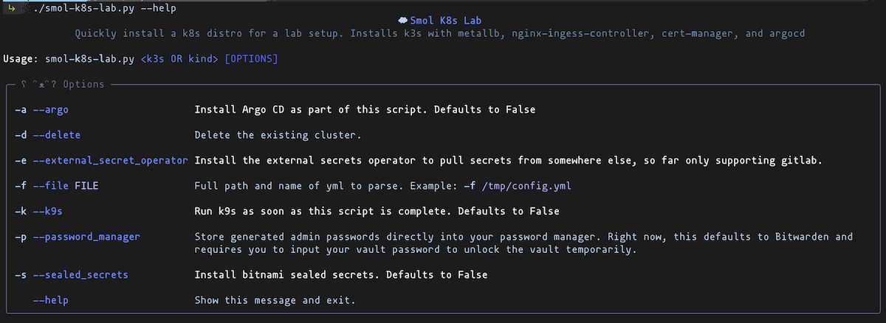

# Smol K8s Lab

Currently in a beta state. This project is aimed at getting up and running quickly with mostly smaller k8s distros in one small command line script, but there's also full tutorials to manually set up each distro in the [docs we maintain](https://jessebot.github.io/smol_k8s_homelab/distros) as well as BASH scripts for basic automation of each k8s distro in each directory under:

`./distro/[NAME OF K8S DISTRO]/bash_full_quickstart.sh`

## Quickstart
Head over to the [Quickstart guide](https://jessebot.github.io/smol_k8s_homelab/quickstart) to get started :blue_heart:

### Currently supported k8s distros

|            Distro                | [smol-k8s-lab.py](./smol-k8s-lab.py) Support|
|:--------------------------------:|:-------------------------------------------:|
|[k3s](https://k3s.io/)            |                     ✅                      | 
|[KinD](https://kind.sigs.k8s.io/) |                     ✅                      | 
|[k0s](https://k0sproject.io/)     |                    soon                     |

### Stack We Install on K8s

We tend to test first one k3s and then kind and then k0s.

|            Application/Tool                   |                       What is it?                      |
|:---------------------------------------------:|:-------------------------------------------------------|
| [metallb](https://github.io/metallb/metallb)  | loadbalancer for metal, since we're mostly selfhosting |
| [cert-manager](https://cert-manager.io/docs/) | For SSL/TLS certificates                               |
| [local path provisioner]()                    | Default simple local file storage                      |
| [k9s](https://k9scli.io/topics/install/)      | Terminal based dashboard for kubernetes                |
| [nginx-ingress](https://github.io/kubernetes/ingress-nginx) | Ingress allows access to the cluster remotely, needed for web traffic |

#### Optionally installed

|                      Application/Tool                            |                         What is it?                       |
|:----------------------------------------------------------------:|:----------------------------------------------------------| 
| [sealed-secrets](https://github.com/bitnami-labs/sealed-secrets) | Encrypts secrets files so you can check them into git     |
| [external-secrets-operator](https://external-secrets.io/v0.5.9/) | integrates external secret management systems like GitLab |
| [argo-cd](https://github.io/argoproj/argo-helm)                  | Gitops - Continuous Deployment                            |

If you install argocd, and you use bitwarden, we'll generate an admin password and automatically place it in your vault if you pass in the `-p` option. Curently only works with Bitwarden.

Want to get started with argocd? If you've installed it via smol_k8s_homelab, then you can jump to here:
https://github.com/jessebot/argo-example#argo-via-the-gui

Otherwise, if you want to start from scratch, start here:
https://github.com/jessebot/argo-example#argocd

#### Other important tools we instal

- [k9s](https://k9scli.io/topics/install/): Terminal based dashboard for kubernetes

## Troubleshooting
If you're stuck, checkout the [Notes](https://jessebot.github.io/smol_k8s_homelab/notes) to see if we also got stuck on the same thing at some point :) Under each app or tool, we'll have notes on how to learn more about it, as well as any errors we've already battled.

## Other Notes
Check out the [`optional`](optional) directory for quick examples on apps this script does not default install.

e.g. for postgres, go to [`./optional/postgres`](./optional/postgres)

## Tooling Used for the script itself and interface
- python3.10
- the following libraries
  - rich (this is what makes all the pretty formatted text)

# Contributions and maintainers
- [@cloudymax](https://github.com/cloudymax)

If you'd like to contribute, feel free to open an issue or pull request and we'll take a look and try to get back to you asap!

# TODO
- install helm for the user. We do it for them. :blue-heart:
- look into https://kubesec.io/
