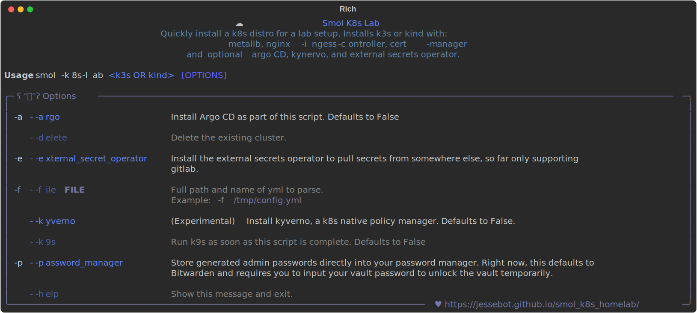

<h2 align="center">
  
smol k8s lab 🧸 <sup><sub>Now with more :squid:</sub></sup>
</h2>

<p align="center">
  <a href="https://github.com/jessebot/smol-k8s-lab/releases">
    
  </a>
</p>

A tool to run slimmer k8s distros on metal, with batteries included. Deploys Argo CD by default, so you can mange your entire local testing lab from the very beginning using files in [open source git repos](), and with the help of a very handy dashboard.

Also helpful for benchmarking various [k8s distros](#supported-k8s-distributions)! 💙


<p align="center">
  <a href="https://raw.githubusercontent.com/jessebot/smol-k8s-lab/main/docs/screenshots/help_text.svg">
      
  </a>
</p>


# Installation
`smol-k8s-lab` requires Python 3.11. If you've already got it and [`brew`] installed, you should be able to:

```bash
# install the CLI
pip3.11 install smol-k8s-lab

# Check the help menu before proceeding
smol-k8s-lab --help
```

## Usage

### Initialization
After you've followed the installation instructions, if you're *new* to `smol-k8s-lab`,  initialize a new config file. To do that, just run:

```bash
# we'll walk you through any configuration needed before saving the config and deploying it for you
smol-k8s-lab
```

<details>
  <summary><h3>Upgrading to v1.x</h3></summary>

If you've installed smol-k8s-lab prior to `v1.0.0`, please backup your old configuration, and then remove the `~/.config/smol-k8s-lab/config.yaml` (or `$XDG_CONFIG_HOME/smol-k8s-lab/config.yaml`) file entirely, then run the following:

```yaml
# this upgrades smol-k8s-lab
pip3.11 install --upgrade smol-k8s-lab

# this initializes a new configuration
smol-k8s-lab
```

</details>

#### Creating a new config without running smol-k8s-lab
This is helpful if you just want to take a look at the default configuration before installing any kubernetes distros. This will also allow you to disable any default applications you'd like ahead of time.

```bash
# create the needed directory if you haven't already, NOTE: this can also be in $XDG_CONFIG_HOME/smol-k8s-lab/config.yaml
mkdir -p ~/.config/smol-k8s-lab

# download the default config file
curl -o config.yaml https://raw.githubusercontent.com/small-hack/smol-k8s-lab/main/smol_k8s_lab/config/default_config.yaml

# move the config file to the config directory (can also be $XDG_CONFIG_HOME/smol-k8s-lab/config.yaml)
mv config.yaml ~/.config/smol-k8s-lab/config.yaml
```

You can now use your text editor of choice to view and edit the default config before running `smol-k8s-lab` :)

## Configuration
You can checkout the default config file [here](./smol_k8s_lab/config/default_config.yaml). We've also got a [Quickstart guide](https://small-hack.github.io/smol-k8s-lab/quickstart) for you to jump right in :)

### Adding custom Applications

You can create any application you already have an Argo CD application repo for, by following a simple application yaml schema in `~/.config/smol-k8s-lab/config.yaml` like this:

```yaml
apps:
  # name of application to create in Argo CD
  cert_manager:
    # if set to false, we ignore this app
    enabled: true
    argo:
      # secret keys to pass to Argo CD Application Set Generator
      secret_keys:
        # Used for letsencrypt-staging, to generate certs. If set to "" and cert-manager.enabled is true
        # smol-k8s-lab will prompt for this value and save it back to this file for you.
        email: ""
      # If set to "", we'll instead use the repo, path, ref, namespace, and project_source_repos
      # else we'll skip installing this app b/c its part of another app of apps with this name.
      part_of_app_of_apps: ""
      # git repo to install the Argo CD app from
      repo: "https://github.com/small-hack/argocd-apps"
      # path in the argo repo to point to. Trailing slash very important!
      path: "ingress/cert-manager/"
      # either the branch or tag to point at in the argo repo above
      ref: "main"
      # namespace to install the k8s app in
      namespace: "ingress"
      # source repos for cert-manager CD App Project (in addition to cert-manager.argo.repo)
      project_source_repos:
        - https://charts.jetstack.io
```

Note: the above application, cert-manager, is already included as a default application in smol-k8s-lab :)

# Under the hood
Note: this project is not officially afilliated with any of the below tooling or applications.

### Supported k8s distributions
We always install the latest version of kubernetes that is available from the distro's startup script.

|  Distro    |         Description              |
|:----------:|:------------------------------------------------------|
| [][k0s] <br /> [k0s] | Simple, Solid & Certified Kubernetes Distribution |
| [][k3s] <br /> [k3s] | The certified Kubernetes distribution built for IoT & Edge computing |
| [][k3d] <br /> [k3d] | **ALPHA - TESTING PHASE** k3s in docker 🐳 |
| [][KinD] <br /> [KinD] | kind is a tool for running local Kubernetes clusters using Docker container “nodes”. kind was primarily designed for testing Kubernetes itself, but may be used for local development or CI. |

We tend to test first on k3s first, then the other distros. k3d support coming soon.

### Default Installed Applications
Version is the helm chart version, or manifest version.

|           Application           |                      Description                      | Initialization Supported |
|:-------------------------------:|:------------------------------------------------------|:------------------------:|
| [][metallb] <br /> [metallb] | Loadbalancer and IP Address pool manager for metal | Yes |
| [][ingress-nginx] <br /> [ingress-nginx] | The ingress controller allows access to the cluster remotely, needed for web traffic | No |
| [][cert-manager] <br /> [cert-manager] | For SSL/TLS certificates | Yes |
| [][Argo CD] <br /> [Argo CD] | Gitops - Continuous Deployment | Yes |
| [][Argo CD Appset Secret Plugin] <br /> [Argo CD Appset Secret Plugin] | Gitops - Continuous Deployment | Yes |
| [][ESO] <br /> [ESO] | external-secrets-operator integrates external secret management systems like Bitwarden or GitLab | No |
| [][Bitwarden ESO Provider] <br /> [Bitwarden ESO Provider] | Bitwarden external-secrets-operator provider  | Yes |
| [][Zitadel] <br /> [Zitadel] | An identity provider and OIDC provider to provide SSO | Yes |
| [][Vouch] <br /> [Vouch] | Vouch proxy allows you to secure web pages that lack authentication e.g. prometheus | Yes |
| [][Prometheus Stack] <br /> [Prometheus Stack] | Prometheus monitoring and logging stack using [loki]/[promtail], [alert manager], and [grafana]  | Yes |


<sub>**Minor Notes**</sub>

<sub>All Default Applications can be disabled through your `~/.config/smol-k8s-lab/config.yaml` file, **except**:</sub>

<sub>1. ingress-nginx is the currently the only supported ingress-controller. traefik support is being worked on.</sub>

<sub>2. Argo CD is optional, but if not installed, smol-k8s-lab will <i>only</i> install: metallb, nginx-ingress, and cert-manager</sub>


### Optionally Installed Applications

| Application/Tool | Description | Initialization Supported |
|:----------------:|:------------|:------------------------:|
| [][Cilium] <br /> [Cilium]<sup>alpha</sup> | Kubernetes netflow visualizer and policy editor | Yes |
| [][Kyverno] <br /> [Kyverno]<sup>alpha</sup> | Kubernetes native policy management to enforce policies on k8s resources | No |
| [][Keycloak] <br /> [KeyCloak]<sup>alpha</sup> | Self hosted IAM/Oauth2 solution | Yes |
| [][kepler] <br /> [kepler] | Kepler (Kubernetes Efficient Power Level Exporter) uses eBPF to probe energy-related system stats and exports them as Prometheus metrics. | Yes |
| [][k8up] <br /> [k8up] | Backups operator using [restic] to backup to s3 endpoints | Yes |
| [][k8tz] <br /> [k8tz] | Timezone environment variable injector for pods and cronjobs | Yes |
| [][Nextcloud] <br /> [Nextcloud] | Nextcloud is a self hosted file server | Yes |
| [][Mastodon] <br /> [Mastodon] | Mastodon is a self hosted federated social media network  | Yes |
| [][matrix] <br /> [matrix] | Matrix is a self hosted chat platform  | Yes |
| [][minio] <br /> [minio] | Self hosted S3 Object Store operator | Yes |
| [][k9s]</br>[k9s] | Terminal based dashboard for kubernetes | Yes |


## Troubleshooting
If you're stuck, checkout the [Notes](https://jessebot.github.io/smol-k8s-lab/notes) to see if we also got stuck on the same thing at some point :) Under each kubernetes distro or application, we'll have notes on how to learn more about it, as well as any errors we've already battled.


# Status
This is still in later alpha, as we figure out all the apps and distros we want to support, and pin all the versions, but if you'd like to contribute or just found a :bug:, feel free to open an issue (or pull request), and we'll take a look! We'll try to get back to you asap!


### Development
smol-k8s-lab is written in Python and built and published using [Poetry]. You can check out the `pyproject.toml` for the versions of each library we install below:

- [rich] (this is what makes all the pretty formatted text)
- [PyYAML] (to handle the k8s yamls and configs)
- [bcrypt] (to pass a password to argocd and automatically update your Bitwarden)
- [click] (handles arguments for the CLI)

We also utilize the [Bitwarden cli], for a password manager so you never have to see/know your argocd password.

## And more!

Want to get started with argocd? If you've installed it via smol-k8s-lab, then you can jump [here](https://github.com/jessebot/argo-example#argo-via-the-gui). Otherwise, if you want to start from scratch, start [here](https://github.com/jessebot/argo-example#argocd)

<!-- k8s distro link references -->
[k3s]: https://k3s.io/
[k3d]: https://k3d.io/
[KinD]: https://kind.sigs.k8s.io/
[k0s]: https://k0sproject.io/

<!-- k8s optional apps link references -->
[ESO]: https://external-secrets.io/v0.8.1/
[alert manager]: https://prometheus.io/docs/alerting/latest/alertmanager/
[Argo CD]:https://argo-cd.readthedocs.io/en/latest/
[Argo CD Appset Secret Plugin]: https://github.com/jessebot/argocd-appset-secret-plugin/
[cert-manager]: https://cert-manager.io/docs/
[cilium]: https://github.com/cilium/cilium/tree/v1.14.1/install/kubernetes/cilium
[Bitwarden ESO Provider]: https://github.com/jessebot/bitwarden-eso-provider
[grafana]: https://grafana.com/
[ingress-nginx]: https://github.io/kubernetes/ingress-nginx
[k8tz]: https://github.com/small-hack/argocd-apps/tree/main/alpha/k8tz
[k8up]: https://k8up.io
[Kyverno]: https://github.com/kyverno/kyverno/
[kepler]: https://github.com/sustainable-computing-io/kepler-helm-chart/tree/main/chart/kepler
[Keycloak]: https://github.com/bitnami/charts/tree/main/bitnami/keycloak/templates
[Local Path Provisioner]: https://github.com/rancher/local-path-provisioner
[loki]: https://grafana.com/oss/loki/
[Mastodon]: https://joinmastodon.org/
[matrix]: https://matrix.org/
[metallb]: https://github.io/metallb/metallb "metallb"
[minio]: https://min.io/
[Nextcloud]: https://github.com/nextcloud/helm
[Prometheus Stack]: https://github.com/small-hack/argocd-apps/tree/main/prometheus
[promtail]: https://grafana.com/docs/loki/latest/send-data/promtail/
[Vouch]: https://github.com/jessebot/vouch-helm-chart
[Zitadel]: https://github.com/zitadel/zitadel-charts/tree/main

<!-- k8s tooling reference -->
[`brew`]: https://brew.sh
[k9s]: https://k9scli.io/topics/install/
[restic]: https://restic.readthedocs.io/en/stable/

<!-- smol-k8s-lab dependency lib link references -->
[Poetry]: https://python-poetry.org/
[rich]: https://github.com/Textualize/richP
[PyYAML]: https://pyyaml.org/
[bcrypt]: https://pypi.org/project/bcrypt/
[click]: https://pypi.org/project/click/
[Bitwarden cli]: https://bitwarden.com/help/cli/
