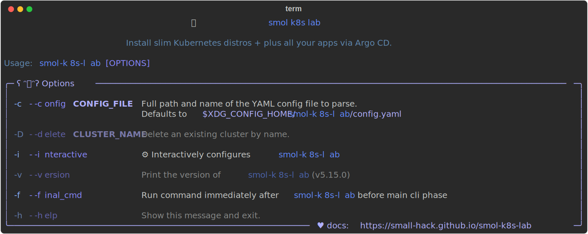

!!! Note
    `smol-k8s-lab` is only tested on Debian, Ubuntu, and macOS. It may run on other Linux distros and even WSL, but we do not actively test them at this time.

## Install via `brew`

[brew] is the preferred installation method for macOS/Debian/Ubuntu, as this will also install any prerequisites you need.

```bash
# tap the special homebrew repo for our formula and then install
brew install small-hack/tap/smol-k8s-lab
```

Then you should be able to check the version and cli options with:

```bash
smol-k8s-lab --help
```

## Install via `pipx`

### Prerequisites

#### Required

`smol-k8s-lab` cannot function without at least the following installed:

- [Python](https://www.python.org/downloads/) (`>=3.11`), and [`pip`](https://pip.pypa.io/en/stable/installation/)
- [`kubectl`](https://kubernetes.io/docs/tasks/tools/)
- [`helm`](https://helm.sh/docs/intro/install/)
- [`argocd`](https://argo-cd.readthedocs.io/en/stable/cli_installation/)
- on Debian only: [libasound2 and libasound2-plugins](https://wiki.debian.org/ALSA#Packages)

#### Optional

All of these are not Required for core functionality of `smol-k8s-lab`, but they greatly enhance the experience, so they are still recommended.

| application | description                                                               |
|-------------|---------------------------------------------------------------------------|
| [docker]    | needed for k3d, kind, and installing the mastodon app                     |
| [bw]        | only if you want to use Bitwarden to store your passwords                 |
| [k3d]       | only if you want to use k3d                                               |
| [k9s]       | only if you want a k8s TUI for viewing an already installed cluster       |
| [kind]      | only if you want to use kind                                              |
| [mc]        | only if you want smol-k8s-lab to create MinIO users and buckets for you   |
| [restic]    | only if you want smol-k8s-lab to  restore backups for you for select apps |


## pipx
`smol-k8s-lab` requires Python 3.11+ (and [pipx](https://github.com/pypa/pipx)). If you've already got both and [other pre-reqs](https://small-hack.github.io/smol-k8s-lab/installation/#prerequisites), you should be able to:

```bash
# install the CLI
pipx install smol-k8s-lab

# Check the help menu before proceeding
smol-k8s-lab --help
```

<details>
  <summary>Help text example</summary>

  <a href="../assets/images/screenshots/help_text.svg">
    
  </a>

</details>

## Usage

### Initialization
After you've followed the installation instructions, if you're *new* to `smol-k8s-lab`,  initialize a new config file by running:

```bash
# we'll walk you through any configuration needed
# before saving the config and deploying it for you
smol-k8s-lab
```

<details>
  <summary><h3>Upgrading to v1.x, v2.x, v3.x</h3></summary>

If you've installed smol-k8s-lab prior to <code>v3.0.0</code>, please backup your old configuration, <code>~/.config/smol-k8s-lab/config.yaml</code> (or <code>$XDG_CONFIG_HOME/smol-k8s-lab/config.yaml</code>), and then remove the file entirely. Then, run the following if you're using pip:

```bash
# this upgrades smol-k8s-lab
pip install --upgrade smol-k8s-lab

# this initializes a new configuration
smol-k8s-lab
```

if you're using pipx:
```bash
# this upgrades smol-k8s-lab
pipx upgrade smol-k8s-lab

# this initializes a new configuration
smol-k8s-lab
```

For details on exactly what's changed, please check out the release notes in the <a href="https://github.com/small-hack/smol-k8s-lab/releases">GitHub Releases</a>.

</details>

#### Creating a new config without running smol-k8s-lab
This is helpful if you just want to take a look at the default configuration before installing any Kubernetes distros. This will also allow you to disable any default applications you'd like ahead of time.

```bash
# create the needed directory if you haven't already, NOTE: this can also be in $XDG_CONFIG_HOME/smol-k8s-lab/config.yaml
mkdir -p ~/.config/smol-k8s-lab

# download the default config file
curl -o config.yaml https://raw.githubusercontent.com/small-hack/smol-k8s-lab/main/smol_k8s_lab/config/default_config.yaml

# move the config file to the config directory (can also be $XDG_CONFIG_HOME/smol-k8s-lab/config.yaml)
mv config.yaml ~/.config/smol-k8s-lab/config.yaml
```

You can now use your text editor of choice to view and edit the default config before running `smol-k8s-lab` :)

## Configuration
You can checkout the [default config file](./smol_k8s_lab/config/default_config.yaml) as well as our [config file docs](/config_file).

We also highly recommend checking out the [TUI (Terminal User Interface)](/tui/create_modify_screens) for you to jump right in :)

Finally, for more info on applications we install, checkout [default apps](k8s_apps/argocd).


[brew]: https://brew.sh/
[docker]: https://docs.docker.com/engine/install/
[bw]: https://bitwarden.com/help/cli/#download-and-install
[k3d]: https://k3d.io/v5.6.0/#installation
[k9s]: https://k9s.io
[kind]: https://kind.sigs.k8s.io/docs/user/quick-start/#installation
[mc]: https://min.io/docs/minio/linux/reference/minio-mc.html#install-mc
