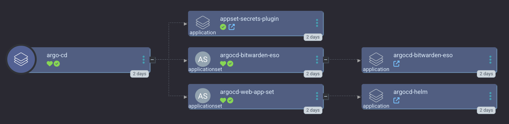

Argo CD exclusively powers _most_ of the applications that `smol-k8s-lab` supports. It should be installed by default if you use the default configuration.

## Default Argo CD configuration

Argo CD is one of the most complex applications we deploy for you. We follow this procedure:

1. Install Argo CD first with helm using some bare minimum options that include setting up your initial admin password.
   The reason we set up a password for you instead of letting Argo CD generate it for you, is so that we can store it in your password manager for later use.
2. Deploy the [appset-secret-plugin](https://github.com/small-hack/appset-secret-plugin).
3. Optionally deploy an OIDC provider ([Zitadel](/k8s_apps/zitadel.md))
4. Create an Argo CD Application for Argo to manage itself

The final Application will be sourced from [small-hack/argocd-apps/argocd](https://github.com/small-hack/argocd-apps/tree/main/argocd), which you can learn more about its readme.

<a href="../../assets/images/screenshots/argocd_screenshot.png">

</a>


## ApplicationSets

We make heavy use of [Argo CD ApplicationSets](https://argo-cd.readthedocs.io/en/stable/operator-manual/applicationset/) in order to utilize [generators](https://argo-cd.readthedocs.io/en/stable/operator-manual/applicationset/Generators/), specifically we use a [Plugin Generator](https://argo-cd.readthedocs.io/en/stable/operator-manual/applicationset/Generators-Plugin/) called [appset-secret-plugin](https://github.com/small-hack/appset-secret-plugin) to store variables in Kubernetes Secrets that can be passed to Argo CD ApplicationSets. This is particularly useful for data such as a specific hostname or timezone for an application.

## Default yaml configuration

```yaml
apps:
  argo_cd:
    # Set to false if you you just want a bare cluster with only the above apps"
    enabled: true
    description: |
      [link=https://argo-cd.readthedocs.io/en/stable/]Argo CD[/link] is a declarative, GitOps continuous delivery tool for Kubernetes.

      smol-k8s-lab installs Argo CD with helm initially to support initial configuration of your admin user and disabling of dex. After your OIDC provider is configured, Argo CD begins managing itself using the below configured Argo CD repo.

      The Appset Secret Plugin is required if you want to use the default [link="https://github.com/small-hack/argocd-apps"]small-hack/argocd-apps[/link] [gold3]argo.repo[/gold3] and default enabled if Argo CD is enabled, so we can create a k8s Secret with your more private info such as hostnames, IP addresses, and emails in a deployment that runs alongside Argo CD to provide Argo CD ApplicationSets This plugin has no ingress and cannot be reached from outside the cluster.

      To disable Appset Secret Plugin, please set directory recursion to false.

      Learn more: [link=https://github.com/small-hack/appset-secret-plugin]https://github.com/small-hack/appset-secret-plugin[/link]
    init:
      enabled: true
    argo:
      # secrets keys to make available to Argo CD ApplicationSets
      secret_keys:
        # FQDN hostname for accessing the Argo CD web interface
        hostname: "argocd.example.com"
        # which oidc provider to use for Argo CD: defaults to Zitadel
        oidc_provider: "zitadel"
      # git repo to install the Argo CD app from
      repo: "https://github.com/small-hack/argocd-apps"
      # path in the argo repo to point to. Trailing slash very important!
      # change to argocd/argocd to not use app of apps with secret plugin
      path: "argocd/app_of_apps/"
      # either the branch or tag to point at in the argo repo above
      revision: main
      # kubernetes cluster to install the k8s app into, defaults to Argo CD default
      cluster: https://kubernetes.default.svc
      # namespace to install the k8s app in
      namespace: "argocd"
      # recurse directories in the provided git repo, if true, we also deploy the appset secret plugin
      directory_recursion: true
      # source repos for Argo CD argo-cd Project (in addition to argo_cd.argo.repo)
      project:
        # you can change this project name :)
        name: argo-cd
        source_repos:
          - https://argoproj.github.io/argo-helm
          - https://small-hack.github.io/appset-secret-plugin
        destination:
          # automatically includes argocd's namespace, so you don't need to specify it here
          namespaces:
            - prometheus
```
