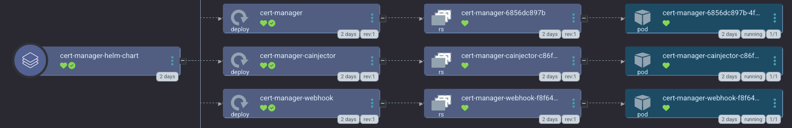

We use [cert-manager](https://cert-manager.io) to generate TLS certs for the web frontends of any apps we install. 

<a href="../../assets/images/screenshots/certmanager_screenshot.png">

</a>

By default, we create two ClusterIssuers using the HTTP01 challenge solver:

- `letsencrypt-staging`
- `letsencrypt-prod`

All applications will use `letsencrypt-staging` by default, until you change this setting via the [TUI](/tui/apps_screen/#modifying-globally-available-templating-parameters-for-argo-cd-applicationsets) or [config file](/config_file/#globally-available-argo-cd-applicationset). We default to the staging server, because `letsencrypt-prod` has very tight rate limiting and when testing, as one does in a lab, you can easily exceed this, which can issue you a ban for at least a week.

Alternatively, you can also use the DNS01 challenge solver with cloudflare only. If you'd like to use a different DNS provider for the DNS01 challenge solver type, please submit a PR as the devs only have regular access to cloudflare and can't test other providers at this time.

## Example configs

### HTTP01 Challenge Solver

This is the default challenge solver.

```yaml
apps:
  # This app is installed with helm or manifests depending on what is recommended
  # for your k8s distro. Becomes managed by Argo CD if you enable it below
  cert_manager:
    # ! NOTE: you currently can't set this to false. It is necessary to deploy
    # most of our supported Argo CD apps since they often have TLS enabled either
    # for pod connectivity or ingress. IF set to false, you need an alternative SSL pipeline
    enabled: true
    description: |
      [link=https://cert-manager.io/]cert-manager[/link] let's you use LetsEncrypt to generate TLS certs for all your apps with ingress.

      smol-k8s-lab supports optional initialization by creating [link=https://cert-manager.io/docs/configuration/acme/]ACME Issuer type[/link] [link=https://cert-manager.io/docs/concepts/issuer/]ClusterIssuers[/link] using either the HTTP01 or DNS01 challenge solvers. We create two ClusterIssuers: letsencrypt-staging and letsencrypt-staging.

      For the DNS01 challange solver, you will need to either export $CLOUDFLARE_API_TOKEN as an env var, or fill in the sensitive value for it each time you run smol-k8s-lab.

      Currently, Cloudflare is the only supported DNS provider for the DNS01 challenge solver. If you'd like to use a different DNS provider or use a different Issuer type all together, please either set one up outside of smol-k8s-lab. We also welcome [link=https://github.com/small-hack/smol-k8s-lab/pulls]PRs[/link] to add these features :)

    # Initialize of the app through smol-k8s-lab
    init:
      # Deploys staging and prod ClusterIssuers and prompts you for
      # values if they were not set. Switch to false if you don't want
      # to deploy any ClusterIssuers
      enabled: true
      values:
        # Used for to generate certs and alert you if they're going to expire
        email: coolfriend@amazingdogs.dog
        # choose between "http01" or "dns01"
        cluster_issuer_acme_challenge_solver: http01
        # only needed if cluster_issuer_challenge_solver set to dns01
        # currently only cloudflare is supported
        cluster_issuer_acme_dns01_provider: cloudflare
      sensitive_values: []
    argo:
      secret_keys: {}
      # git repo to install the Argo CD app from
      repo: "https://github.com/small-hack/argocd-apps"
      # path in the argo repo to point to. Trailing slash very important!
      path: "cert-manager/"
      # either the branch or tag to point at in the argo repo above
      revision: main
      # namespace to install the k8s app in
      namespace: "cert-manager"
      # recurse directories in the provided git repo
      directory_recursion: false
      # source repos for cert-manager CD App Project (in addition to argo.repo)
      project:
        name: cert-manager
        source_repos:
          - https://charts.jetstack.io
        destination:
          # automatically includes the app's namespace and argocd's namespace
          namespaces:
            - kube-system
```


### DNS01 Challenge Solver

For the DNS01 challange solver, you will need to either export `$CLOUDFLARE_API_TOKEN` as an env var, or fill in the sensitive value for it each time you run `smol-k8s-lab`.

```yaml
apps:
  # This app is installed with helm or manifests depending on what is recommended
  # for your k8s distro. Becomes managed by Argo CD if you enable it below
  cert_manager:
    # ! NOTE: you currently can't set this to false. It is necessary to deploy
    # most of our supported Argo CD apps since they often have TLS enabled either
    # for pod connectivity or ingress. IF set to false, you need an alternative SSL pipeline
    enabled: true
    description: |
      [link=https://cert-manager.io/]cert-manager[/link] let's you use LetsEncrypt to generate TLS certs for all your apps with ingress.

      smol-k8s-lab supports optional initialization by creating [link=https://cert-manager.io/docs/configuration/acme/]ACME Issuer type[/link] [link=https://cert-manager.io/docs/concepts/issuer/]ClusterIssuers[/link] using either the HTTP01 or DNS01 challenge solvers. We create two ClusterIssuers: letsencrypt-staging and letsencrypt-staging.

      For the DNS01 challange solver, you will need to either export $CLOUDFLARE_API_TOKEN as an env var, or fill in the sensitive value for it each time you run smol-k8s-lab.

      Currently, Cloudflare is the only supported DNS provider for the DNS01 challenge solver. If you'd like to use a different DNS provider or use a different Issuer type all together, please either set one up outside of smol-k8s-lab. We also welcome [link=https://github.com/small-hack/smol-k8s-lab/pulls]PRs[/link] to add these features :)

    # Initialize of the app through smol-k8s-lab
    init:
      # Deploys staging and prod ClusterIssuers and prompts you for
      # values if they were not set. Switch to false if you don't want
      # to deploy any ClusterIssuers
      enabled: true
      values:
        # Used for to generate certs and alert you if they're going to expire
        email: coolfriend@amazingdogs.dog
        # choose between "http01" or "dns01"
        cluster_issuer_acme_challenge_solver: dns01
        # only needed if cluster_issuer_challenge_solver set to dns01
        # currently only cloudflare is supported
        cluster_issuer_acme_dns01_provider: cloudflare
      sensitive_values:
        # you can remove this if you're not using cloudflare as your DNS01 provider
        # can be passed in as env vars if you pre-pend CERT_MANAGER_
        # e.g. CERT_MANAGER_CLOUDFLARE_API_TOKEN
        - CLOUDFLARE_API_TOKEN
    argo:
      secret_keys: {}
      # git repo to install the Argo CD app from
      repo: "https://github.com/small-hack/argocd-apps"
      # path in the argo repo to point to. Trailing slash very important!
      path: "cert-manager/"
      # either the branch or tag to point at in the argo repo above
      revision: main
      # namespace to install the k8s app in
      namespace: "cert-manager"
      # recurse directories in the provided git repo
      directory_recursion: false
      # source repos for cert-manager CD App Project (in addition to argo.repo)
      project:
        name: cert-manager
        source_repos:
          - https://charts.jetstack.io
        destination:
          # automatically includes the app's namespace and argocd's namespace
          namespaces:
            - kube-system
```

## Troubleshooting

Follow the steps in the [cert-manager common error troubleshooting guide](https://cert-manager.io/docs/faq/acme/#common-errors)), you can also change the `letsencrypt-staging` value to `letsencrypt-prod` for any domains you own and can configure to point to your cluster via DNS.
