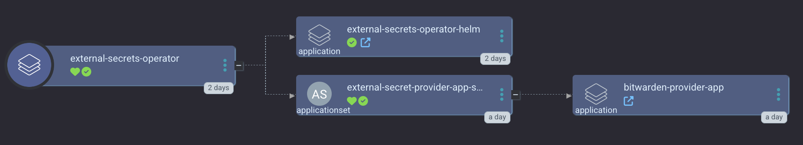

The [External Secrets Operator](https://external-secrets.io/latest/) (abbreviated as ESO) is a Kubernetes operator that integrates external secret management systems like AWS Secrets Manager, HashiCorp Vault, Google Secrets Manager, Azure Key Vault, IBM Cloud Secrets Manager, CyberArk Conjur and many more. The operator reads information from external APIs and automatically injects the values into a Kubernetes Secret.

The goal of External Secrets Operator is to synchronize secrets from external APIs into Kubernetes. ESO is a collection of custom API resources - ExternalSecret, SecretStore and ClusterSecretStore that provide a user-friendly abstraction for the external API that stores and manages the lifecycle of the secrets for you.

<a href="../../assets/images/screenshots/eso_screenshot.png">

</a>

`smol-k8s-lab` default makes heavy use of ESO in conjunction with the [Bitwarden ESO Provider](/k8s_apps/bitwarden_eso_provider.md) to ensure no credentials or sensitive data is stored as plain text in our git repos or in any helm values we provide. We accomplish this goal by always biasing towards using Kubernetes Secrets as sources of truth for helm charts, and those secrets come from Bitwarden by default.

Check out our [ESO Argo CD ApplicationSet](https://github.com/small-hack/argocd-apps/tree/main/external-secrets-operator).

## Default yaml configuration

```yaml
apps_global_config:
  # Must be a string of "" (don't use external secrets) or "bitwarden" to use bitwarden for external secrets*
  external_secrets: "bitwarden"

apps:
  external_secrets_operator:
    enabled: true
    description: |
      [link=https://external-secrets.io/latest/]External Secrets Operator[/link] is a Kubernetes operator that integrates external secret management systems like HashiCorp Vault, CyberArk Conjur, Bitwarden, Gitlab, and many more. The operator reads information from external APIs and automatically injects the values into a Kubernetes Secret.

      To deploy the Bitwarden provider, please set apps_global_config.external_secrets to "bitwarden".

      The [link="https://github.com/small-hack/bitwarden-eso-provider/"]Bitwarden External Secrets Provider[/link] is used to store k8s secrets in Bitwarden®. This deployment has no ingress and can't be connected to from outside the cluster. There is a networkPolicy that only allows the pod to communicate with the External Secrets Operator in the same namespaces.

      smol-k8s-lab support initialization by creating a Kubernetes secret with your Bitwarden credentials so that the provider can unlock your vault. You will need to setup an [link=https://bitwarden.com/help/personal-api-key/]API key[/link] ahead of time. You can pass these credentials in by setting the following environment variables:

      BITWARDEN_PASSWORD, BITWARDEN_CLIENTSECRET, BITWARDEN_CLIENTID
    # Initialization of the app through smol-k8s-lab
    init:
      enabled: false
    argo:
      # git repo to install the Argo CD app from
      repo: https://github.com/small-hack/argocd-apps
      # path in the argo repo to point to. Trailing slash very important!
      # change to external-secrets-operator/external-secrets-operator/ to deploy
      # ONLY the external-secrets-operator, so this will not use app of apps and
      # therefore we will not deploy the Bitwarden ESO provider. Use if you want to use
      # a different provider
      path: external-secrets-operator/app_of_apps/
      # either the branch or tag to point at in the argo repo above
      revision: main
      # namespace to install the k8s app in
      namespace: external-secrets
      # recurse directories in the provided git repo
      directory_recursion: false
      # secret keys to provide for the Argo CD Appset secret plugin, none by default
      secret_keys: {}
      # source repos for Argo CD App Project (in addition to app.argo.repo)
      project:
        name: external-secrets-operator
        source_repos:
          - https://charts.external-secrets.io
          # you can remove this one if you're not using bitwarden to store your k8s secrets
          - https://small-hack.github.io/bitwarden-eso-provider
        destination:
          # automatically includes the app's namespace and argocd's namespace
          namespaces: []
```
