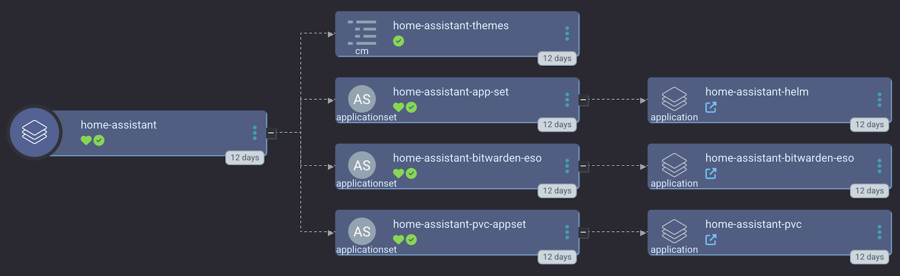
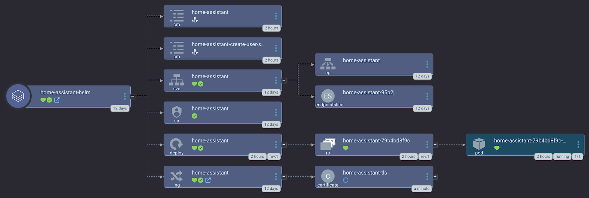

[Home Assistant](https://www.home-assistant.io/) is an open source IoT management solution. We deploy a [small-hack maintained helm chart](https://github.com/small-hack/home-assistant-chart/) by default, which allows us to:

- specify a default `configuration.yaml`
- create an initial user to disable public registration

When deployed via Argo CD using `smol-k8s-lab`, we create an app of apps like this:

<a href="../../assets/images/screenshots/home-assistant.png">

</a>

The most important app in the apps of apps is the helm chart app which looks like this:

<a href="../../assets/images/screenshots/home-assistant-helm.png">

</a>

*NOTE*: You'll need to enable the [Generic Device Plugin](/k8s_apps/generic-device-plugin.md) as a prereq in order to use USB devices with home assistant.

### Secret Keys

The main variables you need to worry about when setting up home assistant is your `hostname`.

### Sensitive Values

Sensitive values can be provided via environment variables using a `value_from` map on any value under `init.values` or `backups`. Example of providing the SMTP password:

```yaml
apps:
  home_assistant:
    init:
      values:
        password:
          value_from:
            env: HA_PASSWORD
```


#### Sensitive values before `v5.0.0`

`smol-k8s-lab` did not originally support the `value_from` map. If you're using a version *before `v5.0.0`*, to avoid having to provide sensitive values every time you run `smol-k8s-lab` with matrix enabled, set up the following environment variables:

```bash
# this is for the admin user password
export HOME_ASSISTANT_PASSWORD="mysupersecretpassword"
```

## Backups

Backups are a new feature in `v5.0.0` that enable backing up your cluster via restic to a configurable remote S3 bucket. If you have `init.enabled` set to `true` and you're using our pre-configured `argo.repo`, we support both instant backups, and scheduled backups.

To use the backups feature, you'll need to configure the values below.

```yaml
apps:
  home_assistant:
    backups:
      # cronjob syntax schedule to run home assistant pvc backups
      pvc_schedule: 45 23 * * *
      s3:
        # these are for pushing remote backups of your local s3 storage, for speed and cost optimization
        endpoint: s3.eu-central-003.backblazeb2.com
        bucket: my-home-assistant-bucket
        region: eu-central-003
        secret_access_key:
          value_from:
            env: HOME_ASSISTANT_S3_BACKUP_SECRET_KEY
        access_key_id:
          value_from:
            env: HOME_ASSISTANT_S3_BACKUP_ACCESS_ID
      restic_repo_password:
        value_from:
          env: HOME_ASSISTANT_RESTIC_REPO_PASSWORD
```

## Restores

Restores are a new feature in `v5.0.0` that enable restoring your PVCs via restic from a configurable remote S3 bucket. If you have `init.enabled` set to `true` and you're using our pre-configured `argo.repo`, we support restoring your PVC. A restore is a kind of initialization process, so it lives under the `init` section of the config for your application, in this case, home-assistant. Here's an example:

```yaml
apps:
  home-assistant:
    init:
      enabled: true
      restore:
        # set this to false to disable restore
        enabled: true
        restic_snapshot_ids:
          # defaults to latest, but can be changed to any restic snapshot ID
          home_assistant: latest
```


## Example configs

### Using tolerations and node affinity

```yaml
apps:
  home-assistant:
    description: |
      [link=https://home-assistant.io]Home Assistant[/link] is a home IOT management solution.

      By default, we assume you want to use node affinity and tolerations to keep home assistant pods on certain nodes and keep other pods off said nodes. If you don't want to use either of these features but still want to use the small-hack/argocd-apps repo, first change the argo path to /home-assistant/ and then remove the 'toleration_' and 'affinity' secret_keys from the yaml file under apps.home_assistant.description.

      [b]NOTE[/b]: If you want to pass in a USB device, you will need the generic device plugin (which is available as a default Argo CD app via smol-k8s-lab 💙)

      This app takes one sensitive value, password for the initial owner user. You can also pass it in as an enviornment variable called $HOME_ASSISTANT_PASSWORD.
    # Initialization of the app through smol-k8s-lab
    init:
      # enable the creation of an initial owner user
      enabled: true
      restore:
        enabled: false
        restic_snapshot_ids:
          home_assistant: latest
      values:
        # -- owner user's name
        name: "admin"
        # -- owner user's username
        user_name: "admin"
        # -- owner user's language, default is english
        language: "en"
        password:
          value_from:
            env: HOME_ASSISTANT_PASSWORD
    backups:
      # cronjob syntax schedule to run home assistant pvc backups
      pvc_schedule: 45 23 * * *
      s3:
        # these are for pushing remote backups of your local s3 storage, for speed and cost optimization
        endpoint: s3.eu-central-003.backblazeb2.com
        bucket: my-home-assistant-bucket
        region: eu-central-003
        secret_access_key:
          value_from:
            env: HOME_ASSISTANT_S3_BACKUP_SECRET_KEY
        access_key_id:
          value_from:
            env: HOME_ASSISTANT_S3_BACKUP_ACCESS_ID
      restic_repo_password:
        value_from:
          env: HOME_ASSISTANT_RESTIC_REPO_PASSWORD
    argo:
      secret_keys:
        hostname: ""
        # name of your home assistant area, users often just use "home"
        name: "home"
        # default alpha-2 country code, default is NL which is The Netherlands
        country: "NL"
        # currency code to use for calculating costs, defaults to EUR for euro
        currency: "EUR"
        # other option is "imperial"
        unit_system: "metric"
        # set to F for USA imperialist tempurature
        temperature_unit: "C"
        # latitude of your personal coordinates
        latitude: ""
        # longitude of your personal coordinates
        longitude: ""
        # the elevation of your house?
        elevation: "1"
        # you can delete these if you're not using tolerations/affinity
        toleration_key: "reserved"
        toleration_operator: "Equal"
        toleration_value: "iot"
        toleration_effect: "NoSchedule"
        # these are for node affinity, delete if not in use
        affinity_key: "reserved"
        affinity_value: "iot"
        # these are for passing in a USB device such as the conbee II
        usb_device_path: "/dev/serial/by-id/usb-device-here"
        usb_device_mount_path: "/dev/ttyACM0"
        usb_device_index: "1"
        # these are for passing in a bluetooth device
        bluetooth_device_path: /run/dbus
        bluetooth_device_mount_path: /run/dbus
        bluetooth_device_index: '2'
      repo: https://github.com/small-hack/argocd-apps
      path: home-assistant/toleration_and_affinity/
      revision: main
      # kubernetes cluster to install the k8s app into, defaults to Argo CD default
      cluster: https://kubernetes.default.svc
      namespace: home-assistant
      directory_recursion: false
      project:
        name: home-assistant
        source_repos:
          - https://small-hack.github.io/home-assistant-chart
        destination:
          namespaces:
            - argocd
```

### Without tolerations and node affinity

```yaml
apps:
  home_assistant:
    enabled: true
    description: |
      [link=https://home-assistant.io]Home Assistant[/link] is a home IOT management solution.
    init:
      enabled: true
      restore:
        enabled: false
        restic_snapshot_ids:
          home_assistant: latest
      values:
        # -- owner user's name
        name: "admin"
        # -- owner user's username
        user_name: "admin"
        # -- owner user's language, default is english
        language: "en"
        password:
          value_from:
            env: HOME_ASSISTANT_PASSWORD
    backups:
      # cronjob syntax schedule to run home assistant pvc backups
      pvc_schedule: 45 23 * * *
      s3:
        # these are for pushing remote backups of your local s3 storage, for speed and cost optimization
        endpoint: s3.eu-central-003.backblazeb2.com
        bucket: my-home-assistant-bucket
        region: eu-central-003
        secret_access_key:
          value_from:
            env: HOME_ASSISTANT_S3_BACKUP_SECRET_KEY
        access_key_id:
          value_from:
            env: HOME_ASSISTANT_S3_BACKUP_ACCESS_ID
      restic_repo_password:
        value_from:
          env: HOME_ASSISTANT_RESTIC_REPO_PASSWORD
    argo:
      secret_keys:
        hostname: ""
        # name of your home assistant area, users often just use "home"
        name: "home"
        # default alpha-2 country code, default is NL which is The Netherlands
        country: "NL"
        # currency code to use for calculating costs, defaults to EUR for euro
        currency: "EUR"
        # other option is "imperial"
        unit_system: "metric"
        # set to F for USA imperialist tempurature
        temperature_unit: "C"
        # latitude of your personal coordinates
        latitude: ""
        # longitude of your personal coordinates
        longitude: ""
        # the elevation of your house?
        elevation: ""
      repo: https://github.com/small-hack/argocd-apps
      path: home-assistant/
      revision: main
      # kubernetes cluster to install the k8s app into, defaults to Argo CD default
      cluster: https://kubernetes.default.svc
      namespace: home-assistant
      directory_recursion: false
      project:
        name: home-assistant
        source_repos:
          - https://small-hack.github.io/home-assistant-chart
        destination:
          namespaces:
            - argocd
```
