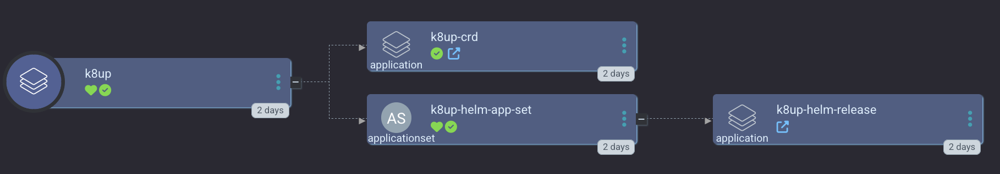

[K8up](https://k8up.io/) is a Kubernetes app that utilizes [Restic](https://restic.net/) to create backups of persistent volume claims to object stores like S3, MinIO, and Backblaze B2.

`smol-k8s-lab` optionally installs K8up as one of it's supported Kubernetes applications using [Argo CD repo with K8up template](https://gitlab.com/small-hack/argocd-apps/blob/main/k8up).

<a href="../../assets/images/screenshots/k8up_screenshot.png">

</a>

One of the most important template values we require for our default Argo CD ApplicationSet is `timezone`, which should be a timezone from the [TZ database](https://en.wikipedia.org/wiki/List_of_tz_database_time_zones#List) (in the wikipedia list, you want the second column, TZ Identifier).


### API Docs

The full API docs are [here](https://doc.crds.dev/github.com/k8up-io/k8up@v2.3.0).

- [One time Backups](https://doc.crds.dev/github.com/k8up-io/k8up/k8up.io/Backup/v1@v2.3.0)
- [Scheduled Backups](https://doc.crds.dev/github.com/k8up-io/k8up/k8up.io/Schedule/v1@v2.3.0)
- [Restores](https://doc.crds.dev/github.com/k8up-io/k8up/k8up.io/Backup/v1@v2.3.0)

## Example config

```yaml
apps:
  k8up:
    enabled: true
    description: |
      K8up ([i]pronounced "ketchup?"[/]) is a Kubernetes Operator based on Restic for backups of Persistent Volumes in k8s into S3 compatible storage like MinIO. Backs up all PVCs marked as ReadWriteMany, ReadWriteOnce or with a specific label. Can also perform "Application Aware" backups, containing the output of any tool capable of writing to stdout.

      You can also perform individual, on-demand backups, and restores from the k8up CLI tool.
      You can find your timezone identifier here: [link=https://wikipedia.org/wiki/List_of_tz_database_time_zones#List]https://wikipedia.org/wiki/List_of_tz_database_time_zones[/link]

      Learn more: [link=https://k8up.io]https://k8up.io[/link]
    init:
      enabled: true
    argo:
      secret_keys:
        timezone: "Europe/Amsterdam"
      # git repo to install the Argo CD app from
      repo: "https://github.com/small-hack/argocd-apps"
      # path in the argo repo to point to. Trailing slash very important!
      path: "k8up/"
      # either the branch or tag to point at in the argo repo above
      ref: "main"
      # namespace to install the k8s app in
      namespace: "k8up"
      # source repos for Argo CD App Project (in addition to app.argo.repo)
      project:
        name: k8up
        source_repos:
          - "https://k8up-io.github.io/k8up"
          - "https://github.com/k8up-io/k8up.git"
        destination:
          namespaces:
            - argocd
```
