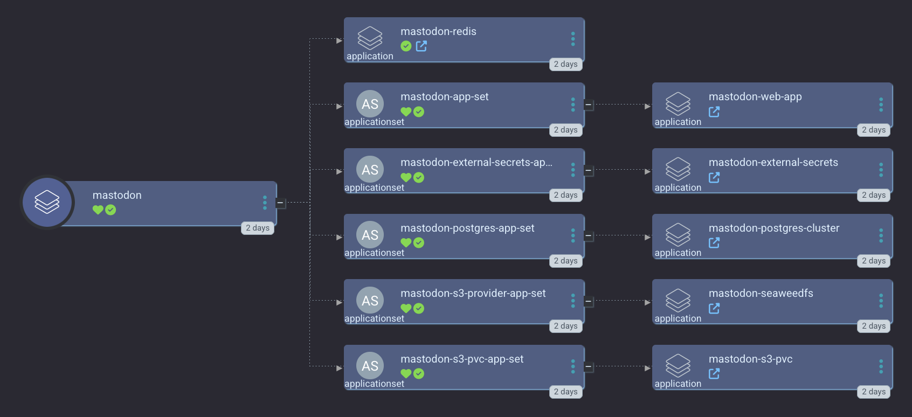

[Mastodon](https://joinmastodon.org/) is a Free and Open Source social media networking platform based on [ActivityPub](https://www.w3.org/TR/activitypub/).

We are mostly stable for running Mastodon on Kubernetes. Check out our [Mastodon Argo CD ApplicationSet](https://github.com/small-hack/argocd-apps/tree/main/mastodon/small-hack):

<a href="../../assets/images/screenshots/mastodon_screenshot.png">

</a>

This is the networking view in Argo CD:

<a href="../../assets/images/screenshots/mastodon_networking_screenshot.png">

</a>

## Required Init Values

To use the default `smol-k8s-lab` Argo CD Application, you'll need to provide one time init values for:

- `admin_user`
- `admin_email`
- `smtp_user`
- `smtp_host`

## Required ApplicationSet Values

And you'll also need to provide the following values to be templated for your personal installation:

- `hostname` - the hostname for your web interface

## Required Sensitive Values

If you'd like to setup SMTP, we need a bit more sensitive data. This includes your SMTP password, S3 backup credentials, and restic repo password.

You have two options. You can:

- respond to a one-time prompt for these credentials (one-time _per cluster_)
- export an environment variable

### Environment Variables

You can export the following env vars and we'll use them for your sensitive data:

- `MASTODON_SMTP_PASSWORD`
- `MASTODON_S3_BACKUP_ACCESS_ID`
- `MASTODON_S3_BACKUP_SECRET_KEY`
- `MASTODON_RESTIC_REPO_PASSWORD`

## Example Config

```yaml
apps:
  mastodon:
    description: |
       [link=https://joinmastodon.org/]Mastodon[/link] is an open source self hosted social media network.

       smol-k8s-lab supports initializing mastodon, by setting up your hostname, SMTP credentials, redis credentials, postgresql credentials, and an admin user credentials. We pass all credentials as secrets in the namespace and optionally save them to Bitwarden.

       smol-k8s-lab also creates a local s3 endpoint and as well as S3 bucket and credentials if you enable set mastodon.argo.secret_keys.s3_provider to "minio" or "seaweedfs". Both seaweedfs and minio require you to specify a remote s3 endpoint, bucket, region, and accessID/secretKey so that we can make sure you have remote backups.

       To provide sensitive values via environment variables to smol-k8s-lab use:
         - MASTODON_SMTP_PASSWORD
         - MASTODON_S3_BACKUP_ACCESS_ID
         - MASTODON_S3_BACKUP_SECRET_KEY
         - MASTODON_RESTIC_REPO_PASSWORD
    enabled: false
    init:
      enabled: true
      restore:
        enabled: false
        cnpg_restore: true
        restic_snapshot_ids:
          seaweedfs_volume: latest
          seaweedfs_filer: latest
          seaweedfs_master: latest
      values:
        # admin user
        admin_user: "tootadmin"
        # admin user's email
        admin_email: ""
        # mail server to send verification and notification emails
        smtp_host: "change@me-to-enable.mail"
        # mail user for smtp host
        smtp_user: "change me to enable mail"
        smtp_password:
          value_from:
            env: MASTODON_SMTP_PASSWORD
    backups:
      # cronjob syntax schedule to run mastodon pvc backups
      pvc_schedule: 10 0 * * *
      # cronjob syntax (with SECONDS field) for mastodon postgres backups
      # must happen at least 10 minutes before pvc backups, to avoid corruption
      # due to missing files. This is because the backup shows as completed before
      # it actually is
      postgres_schedule: 0 0 0 * * *
      s3:
        # these are for pushing remote backups of your local s3 storage, for speed and cost optimization
        endpoint: s3.eu-central-003.backblazeb2.com
        bucket: my-mastodon-backups
        region: eu-central-003
        secret_access_key:
          value_from:
            env: MASTODON_S3_BACKUP_SECRET_KEY
        access_key_id:
          value_from:
            env: MASTODON_S3_BACKUP_ACCESS_ID
        restic_repo_password:
          value_from:
            env: MASTODON_RESTIC_REPO_PASSWORD
    argo:
      # secrets keys to make available to Argo CD ApplicationSets
      secret_keys:
        admin_user: tootadmin
        # hostname that users go to in the browser
        hostname: ""
        # set the local s3 provider for mastodon's public data in one bucket
        # and private database backups in another. can be minio or seaweedfs
        s3_provider: seaweedfs
        # how large the backing pvc's capacity should be for minio or seaweedfs
        s3_pvc_capacity: 120Gi
        # local s3 endpoint for postgresql backups, backed up constantly
        s3_endpoint: ""
        s3_region: eu-west-1
      # git repo to install the Argo CD app from
      repo: https://github.com/small-hack/argocd-apps
      # path in the argo repo to point to. Trailing slash very important!
      path: mastodon/small-hack/app_of_apps/
      # either the branch or tag to point at in the argo repo above
      revision: main
      # kubernetes cluster to install the k8s app into, defaults to Argo CD default
      cluster: https://kubernetes.default.svc
      # namespace to install the k8s app in
      namespace: mastodon
      # recurse directories in the git repo
      directory_recursion: false
      # source repos for Argo CD App Project (in addition to argo.repo)
      project:
        name: mastodon
        # depending on if you use seaweedfs or minio, you can remove the other source repo
        source_repos:
          - registry-1.docker.io
          - https://small-hack.github.io/cloudnative-pg-cluster-chart
          - https://operator.min.io/
          - https://seaweedfs.github.io/seaweedfs/helm
          - https://small-hack.github.io/mastodon-helm-chart
        destination:
          # automatically includes the app's namespace and argocd's namespace
          namespaces: []
```
