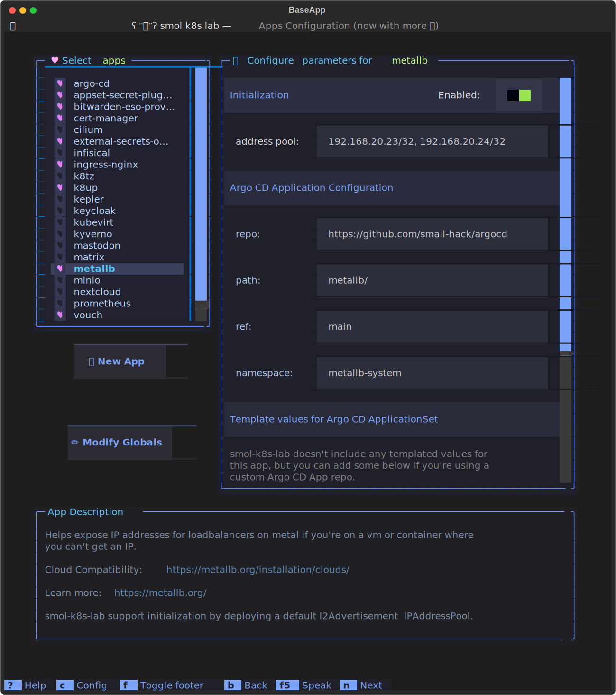

We use [MetalLB](https://metallb.org/) as our load-balancer implementation for bare metal Kubernetes clusters, using standard routing protocols.

`smol-k8s-lab` installs MetalLB by default so that you can run your cluster locally with ease. Prior to using this feature, you need to make sure you have some free IP addresses available on your network. These can be local IPs as long as you have cleared this with your router :)

After `smol-k8s-lab` installs MetalLB on your cluster, we also create a default [`L2Advertisement`](https://metallb.org/configuration/_advanced_l2_configuration/) and a default [`IPAddressPool`](https://metallb.org/configuration/_advanced_ipaddresspool_configuration/) using IP addresses you provide in the init section of the config file, or via the TUI. These are only configured once and won't be redeployed on subsequent runs of `smol-k8s-lab` on the same cluster.

Config file example:

```yaml
apps:
  # This app is installed with helm or manifests depending on what is recommended
  # for your k8s distro. Becomes managed by ArgoCD if you enable it below
  metallb:
    enabled: true
    description: |
      Helps expose IP addresses for loadbalancers on metal if you're on a vm or container where you can't get an IP.

      Cloud Compatibility: [link=https://metallb.org/installation/clouds/]https://metallb.org/installation/clouds/[/link]

      Learn more: [link=https://metallb.org/]https://metallb.org/[/link]

      smol-k8s-lab support initialization by deploying a default l2Advertisement  IPAddressPool.
    # Initialize of the app through smol-k8s-lab
    init:
      enabled: true
      values:
        # these addresses will be used by your ingress controller
        address_pool:
          - 192.168.20.23/32
          - 192.168.20.24/32
    argo:
      # secret keys to provide for the argocd secret plugin app, none by default
      secret_keys: {}
      # git repo to install the Argo CD app from
      repo: https://github.com/small-hack/argocd-apps
      # path in the argo repo to point to. Trailing slash very important!
      path: metallb/
      # either the branch or tag to point at in the argo repo above
      ref: main
      # namespace to install the k8s app in
      namespace: metallb-system
      # source repos for Argo CD metallb Project (in addition to metallb.argo.repo)
      project:
        name: metallb
        source_repos:
        - https://github.com/metallb/metallb.git
        destination:
          namespaces:
          - argocd
          - metallb-system
```

TUI example:

[](../../assets/images/screenshots/metallb_example.svg)

To dig a bit deeper on how we deploy the MetalLB Argo CD app, head over to [small-hack/argocd-apps](https://github.com/small-hack/argocd-apps/tree/main/metallb).

## Why am I getting deprecation notices on certain apps?
If you have the krew deprecations plugin installed, then you might get something like this:
```
Deleted APIs:

PodSecurityPolicy found in policy/v1beta1
	 ├─ API REMOVED FROM THE CURRENT VERSION AND SHOULD BE MIGRATED IMMEDIATELY!!
		-> GLOBAL: metallb-controller
		-> GLOBAL: metallb-speaker
```
For Metallb, that's because of [this issue](https://github.com/metallb/metallb/issues/1401#issuecomment-1140806861). It'll be fixed in October of 2022.
