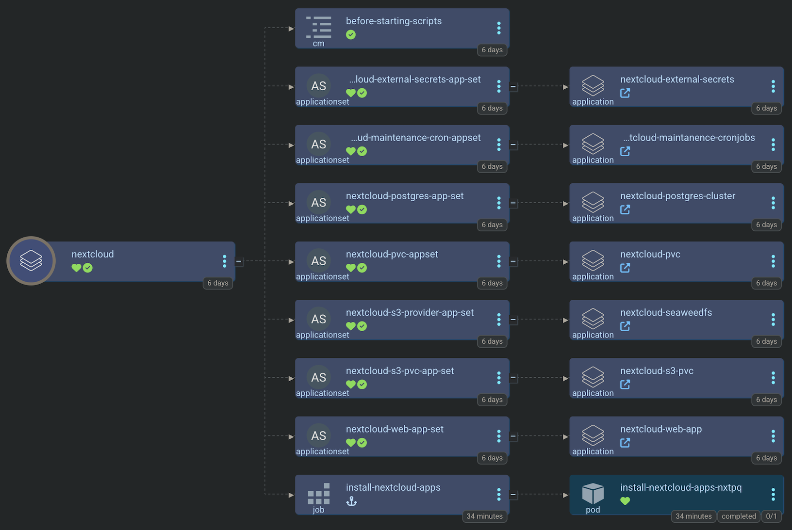
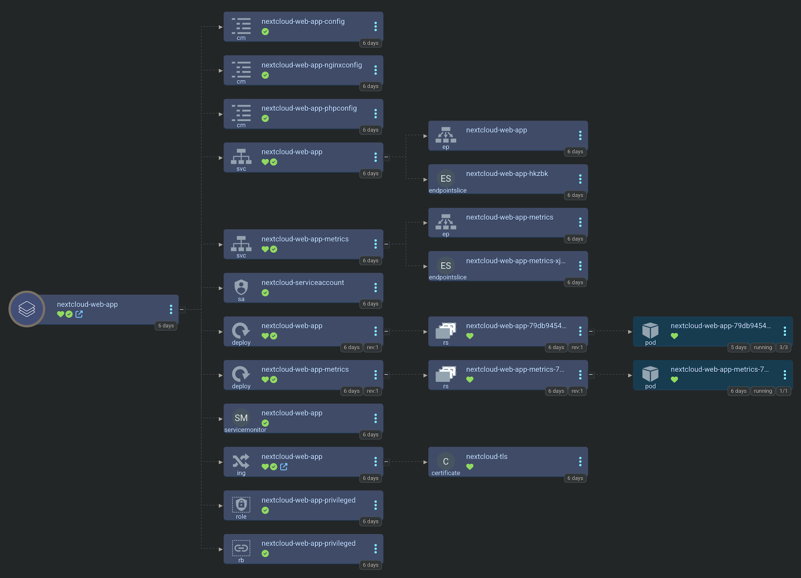

[Nextcloud](https://nextcloud.com/) is an Open Source and self hosted personal cloud which acts as a replacement for Google Drive/Google Photos/iCloud Drive. We can deploy it for you as a featured Argo CD app ([small-hack/argocd-apps/nextcloud](https://github.com/small-hack/argocd-apps/tree/main/nextcloud)) on Kubernetes. Here's an example of the full nextcloud app of apps in Argo CD's web interface:

<a href="../../assets/images/screenshots/nextcloud.png">
  
</a>

<details>
  <summary>Nextcloud Argo CD helm chart app</summary>

  <a href="../../assets/images/screenshots/nextcloud-web-app.png">
    
  </a>

</details>

Part of the `smol-k8s-lab` init process is that we will put the following into your Bitwarden vault:

- administration credentials
- SMTP credentials
- PostgreSQL credentials
- s3 credentials
- OIDC credentials
- Collabora credentials

## Required Values

### Init Values

To use the default `smol-k8s-lab` Argo CD Application, you'll need to provide one time init values for:

- `admin_user`
- `smtp_user`
- `smtp_host`
- `collabora_user`

### Required ApplicationSet Values

And you'll also need to provide the following values to be templated for your personal installation:

- `hostname`
- `default_phone_region`

*These determine how you'd like to set up persistence for nextcloud. We recommend just files enabled for now*

- `files_pvc_enabled`
- `files_storage`
- `files_access_mode`
- `config_pvc_enabled`
- `config_storage`
- `config_access_mode`

### Sensitive values

Sensitive values can be provided via environment variables using a `value_from` map on any value under `init.values` or `backups`. Example of providing the SMTP password:

```yaml
apps:
  nextcloud:
    init:
      values:
        smtp_password:
          value_from:
            env: NC_SMTP_PASSWORD
```


#### Sensitive values before `v5.0.0`

`smol-k8s-lab` did not originally support the `value_from` map. If you're using a version *before `v5.0.0`*, to avoid having to provide sensitive values every time you run `smol-k8s-lab` with nextcloud enabled, set up the following environment variables:

- `NEXTCLOUD_SMTP_PASSWORD`
- `NEXTCLOUD_S3_BACKUP_ACCESS_KEY`
- `NEXTCLOUD_S3_BACKUP_ACCESS_ID`
- `NEXTCLOUD_RESTIC_REPO_PASSWORD`
- `COLLABORA_ONLINE_PASSWORD`


## Backups

Backups are a new feature in `v5.0.0` that enable backing up your postgres cluster and PVCs via restic to a configurable remote S3 bucket. If you have `init.enabled` set to `true` and you're using our pre-configured `argo.repo`, we support both instant backups, and scheduled backups.

When running a nextcloud backup, we will first put your cluster into maintenance mode, then initiate a [Cloud Native Postgresql backup](https://cloudnative-pg.io/documentation/1.23/backup/#on-demand-backups) to your local seaweedfs cluster that we setup for you, and then wait until the last wal archive associated with that backup is complete. After that, we start a k8up backup job to backup all of your important PVCs to your configured s3 bucket. Finally, after the backup is done, we take your cluster our of maintenance mode.

To use the backups feature, you'll need to configure the values below.

```yaml
apps:
  nextcloud:
    backups:
      # cronjob syntax schedule to run nextcloud pvc backups. This example shows PVC Backups
      # happening at 12:10 AM.
      pvc_schedule: 10 0 * * *
      # cronjob syntax (with SECONDS field) for nextcloud postgres backups
      # must happen at least 10 minutes before pvc backups, to avoid corruption
      # due to missing files. This is because the backup shows as completed before
      # it actually is. This example shows postgres backups happening at exactly midnight
      postgres_schedule: 0 0 0 * * *
      s3:
        endpoint: s3.eu-central-003.backblazeb2.com
        bucket: my-nextcloud-backup-bucket
        region: eu-central-003
        secret_access_key:
          value_from:
            env: NC_S3_BACKUP_SECRET_KEY
        access_key_id:
          value_from:
            env: NC_S3_BACKUP_ACCESS_ID
      # restic requires this for encrypting your backups in the remote bucket
      restic_repo_password:
        value_from:
          env: NC_RESTIC_REPO_PASSWORD
```

## Restores

Restores are a new feature in `v5.0.0` that enable restoring your cluster via restic from a configurable remote S3 bucket. If you have `init.enabled` set to `true` and you're using our pre-configured `argo.repo`, we support restoring both your postgres cluster and PVCs. A restore is a kind of initialization process, so it lives under the `init` section of the config for your application, in this case, nextcloud. Here's an example:

```yaml
apps:
  nextcloud:
    enabled: false
    init:
      enabled: true
      restore:
        enabled: false
        # this must be set to true to restore your postgres cluster
        cnpg_restore: true
        # all of these default to latest, but you can set them to any restic snapshot ID
        restic_snapshot_ids:
          seaweedfs_volume: latest
          seaweedfs_filer: latest
          nextcloud_files: latest
```

The restore process will put your secrets into place, then restore your seaweedfs cluster first, followed by your postgresql cluster, followed by your nextcloud PVCs, and then it will install your nextcloud argocd app as normal. Just after it's installed, we'll also take your cluster out of maintenance mode :)


## Full Example Config

```yaml
apps:
  nextcloud:
    enabled: false
    description: |
      [link=https://nextcloud.com/]Nextcloud Hub[/link] is the industry-leading, fully open-source, on-premises content collaboration platform. Teams access, share and edit their documents, chat and participate in video calls and manage their mail and calendar and projects across mobile, desktop and web interfaces

      smol-k8s-lab supports initialization by setting up your admin username, password, and SMTP username and password, as well as your redis and postgresql credentials.

      To avoid providing sensitive values everytime you run smol-k8s-lab, consider exporting the following environment variables before running smol-k8s-lab:
        - NEXTCLOUD_SMTP_PASSWORD
        - NEXTCLOUD_S3_BACKUP_ACCESS_KEY
        - NEXTCLOUD_S3_BACKUP_ACCESS_ID
        - NEXTCLOUD_RESTIC_REPO_PASSWORD
        - COLLABORA_ONLINE_PASSWORD

      Note: smol-k8s-lab is not affiliated with Nextcloud GmbH. This is a community-supported-only install method.
    # initialize the app by setting up new k8s secrets and/or Bitwarden items
    init:
      enabled: true
      restore:
        enabled: true
        cnpg_restore: true
        restic_snapshot_ids:
          seaweedfs_volume: latest
          seaweedfs_filer: latest
          nextcloud_files: latest
      values:
        admin_user: 'mycooladminuser'
        smtp_user: 'mycoolsmtpusername'
        smtp_host: 'mail.cooldogs.net'
        smtp_password:
          value_from:
            env: NEXTCLOUD_SMTP_PASSWORD
        collabora_user: admin
        collabora_password:
          value_from:
            # you can change this to any env var
            env: COLLABORA_ONLINE_PASSWORD
    backups:
      # cronjob syntax schedule to run nextcloud pvc backups
      pvc_schedule: 10 0 * * *
      # cronjob syntax (with SECONDS field) for nextcloud postgres backups
      # must happen at least 10 minutes before pvc backups, to avoid corruption
      # due to missing files. This is because the cnpg backup shows as completed
      # before it actually is, due to the wal archive it lists as it's end not
      # being in the backup yet
      postgres_schedule: 0 0 0 * * *
      s3:
        # these are for pushing remote backups of your local s3 storage, for speed and cost optimization
        endpoint: s3.eu-central-003.backblazeb2.com
        bucket: my-nextcloud-bucket
        region: eu-central-003
        secret_access_key:
          value_from:
            env: NEXTCLOUD_S3_BACKUP_SECRET_KEY
        access_key_id:
          value_from:
            env: NEXTCLOUD_S3_BACKUP_ACCESS_ID
      restic_repo_password:
        value_from:
          env: NEXTCLOUD_RESTIC_REPO_PASSWORD
    argo:
      # secrets keys to make available to Argo CD ApplicationSets
      secret_keys:
        # the FQDN that you want to host nextcloud on
        hostname: "cloud.cooldogs.net"
        # host name for collabora online
        collabora_hostname: "collabora.domain.com"
        # you can delete these if you're not using tolerations/affinity
        toleration_key: ""
        toleration_operator: ""
        toleration_value: ""
        toleration_effect: ""
        # these are for node affinity, delete if not in use
        affinity_key: ""
        affinity_value: ""
        hostname: ""
        # the default phone region for users that don't have one set
        # nextcloud needs this for new users or it throws a warning in the admin panel
        default_phone_region: NL
        # the default domain to send emails to user with
        mail_domain: "domain.com"
        # the default user to use with mail_domain for sending emails, formats to no-reply@domain.com
        mail_from_address: "no-reply"
        # enable persistent volume claim for nextcloud files storage
        files_pvc_enabled: 'true'
        # size of files pvc storage
        files_storage: 100Gi
        files_access_mode: ReadWriteOnce
        # you can also comment this out and we'll use the global storage class
        files_storage_class: "local-path"
        # enable persistent volume claim for nextcloud config storage
        config_pvc_enabled: 'false'
        # size of config pvc storage
        config_storage: 20Gi
        config_access_mode: ReadWriteOnce
        # you can also comment this out and we'll use the global storage class
        config_storage_class: "local-path"
        # choose S3 as the local primary object store from either: seaweedfs, or minio
        # SeaweedFS - deploy SeaweedFS filer/s3 gateway
        # MinIO     - deploy MinIO vanilla helm chart
        s3_provider: seaweedfs
        # the endpoint you'd like to use for your minio or SeaweedFS instance
        s3_endpoint: cloud-s3.cooldogs.net
        # how large the backing pvc's capacity should be for minio or seaweedfs
        s3_pvc_capacity: 10Gi
        # you can also comment this out and we'll use the global storage class
        s3_pvc_storage_class: local-path
        s3_region: eu-west-1
        # cronjob schedule to turn on nextcloud maintenance mode for backups
        maintenance_mode_on_schedule: 30 23 * * *
        # cronjob schedule to turn off nextcloud maintenance mode after backups
        maintenance_mode_off_schedule: 30 1 * * *
      # git repo to install the Argo CD app from
      repo: "https://github.com/small-hack/argocd-apps"
      # path in the argo repo to point to. Trailing slash very important!
      # you can also use nextcloud/app_of_apps_with_tolerations/ if you have a
      # special nextcloud node you want to apply affinity and tolerations for
      path: "nextcloud/app_of_apps/"
      # either the branch or tag to point at in the argo repo above
      revision: "main"
      # kubernetes cluster to install the k8s app into, defaults to Argo CD default
      cluster: https://kubernetes.default.svc
      # namespace to install the k8s app in
      namespace: "nextcloud"
      # recurse directories in the provided git repo
      directory_recursion: false
      # source repos for Argo CD App Project (in addition to argo.repo)
      project:
        name: nextcloud
        source_repos:
          - registry-1.docker.io
          - https://nextcloud.github.io/helm
          - https://small-hack.github.io/cloudnative-pg-cluster-chart
          - https://seaweedfs.github.io/seaweedfs/helm
          - https://github.com/seaweedfs/seaweedfs
        destination:
          namespaces: []
```
