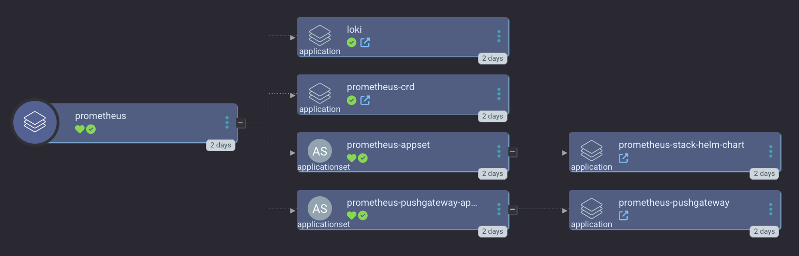

[Prometheus](https://prometheus.io/docs/introduction/overview/) is the core of our optionally installed monitoring stack. Together with [Grafana](https://grafana.com/) and [loki](https://grafana.com/oss/loki/), we cover gathering metrics and logs as well as creating dashboards. We even deploy [alert-manager](https://prometheus.io/docs/alerting/latest/alertmanager/) for you to create your own alerts.

You can see an overview of the whole Prometheus Stack Argo CD Application at [small-hack/argocd-apps/prometheus](https://github.com/small-hack/argocd-apps/tree/main/prometheus).

<a href="../../assets/images/screenshots/prometheus_screenshot.png">

</a>

## Important note

We haven't generated new screenshots, but we've updated how we now deploy the Prometheus CRDs. They are now deployed separately, so that anything that relies on them that gets deployed earlier on, such as your identity provider, which you may want to secure the prometheus related frontends.

## Example configs

### Custom Resource Definitions (CRDs)

```yaml
apps:
  prometheus_crds:
    description: |
      [link=https://prometheus.io/docs/introduction/overview/]Prometheus[/link] CRDs to start with.
      You can optionally disable this if you don't want to deploy apps with metrics.

    enabled: true
    argo:
      # secrets keys to make available to Argo CD ApplicationSets
      secret_keys: {}
      # git repo to install the Argo CD app from
      repo: https://github.com/small-hack/argocd-apps
      # path in the argo repo to point to. Trailing slash very important!
      path: prometheus/crds/
      # either the branch or tag to point at in the argo repo above
      revision: main
      # kubernetes cluster to install the k8s app into, defaults to Argo CD default
      cluster: https://kubernetes.default.svc
      # namespace to install the k8s app in
      namespace: prometheus
      # recurse directories in the provided git repo
      directory_recursion: false
      # source repos for Argo CD App Project (in addition to argo.repo)
      project:
        name: prometheus
        source_repos:
        - https://github.com/prometheus-community/helm-charts.git
        destination:
          # automatically includes the app's namespace and argocd's namespace
          namespaces:
          - kube-system
          - prometheus
```

### kube-prometheus-stack

**NOTE**: You need to *also* enable the CRD app above for this to work!

```yaml
apps:
  prometheus:
  prometheus:
    description: |
      Full monitoring stack with [link=https://prometheus.io/docs/introduction/overview/]Prometheus[/link], [link=https://grafana.com/oss/loki/]Loki[/link], [link=https://prometheus.io/docs/alerting/latest/alertmanager/]Alert Manager[/link], and [link=https://grafana.com/oss/grafana/]Grafana[/link].

      smol-k8s-lab supports initialization by setting up your ingress hostnames. It will also setup Oauth2 for Grafana directly by creating an app in Zitadel for you.

      For Prometheus and Alert Manager, we use vouch-proxy via Ingress resource annotations to forward users to Zitadel for auth, so the frontend is not insecure.
    enabled: false
    init:
      # if init is enabled, we'll set up an app in Zitadel for using Oauth2 with Grafana
      enabled: true
    argo:
      # secrets keys to make available to Argo CD ApplicationSets
      secret_keys:
        # FQDN to use for Prometheus web interface
        hostname: ""
        # FQDN to use for grafana
        grafana_hostname: ""
        # FQDN to use for Alert Manager web interface
        alert_manager_hostname: ""
        # FQDN to use for the prometheus push gateway
        push_gateway_hostname: ""
      # git repo to install the Argo CD app from
      repo: https://github.com/small-hack/argocd-apps
      # path in the argo repo to point to. Trailing slash very important! This
      # is an app of apps. Change to "monitoring/kube-prometheus-stack/" to
      # only install kube-prometheus-stack (foregoing loki and push gateway)
      path: prometheus/app_of_apps/
      # either the branch or tag to point at in the argo repo above
      revision: main
      # kubernetes cluster to install the k8s app into, defaults to Argo CD default
      cluster: https://kubernetes.default.svc
      # namespace to install the k8s app in
      namespace: "prometheus"
      # recurse directories in the provided git repo
      directory_recursion: false
      # source repos for Argo CD App Project (in addition to argo.repo)
      project:
        name: prometheus
        source_repos:
          - "registry-1.docker.io"
          - "https://github.com/prometheus-community/helm-charts.git"
          - "https://prometheus-community.github.io/helm-charts"
        destination:
          # automatically includes the app's namespace and argocd's namespace
          namespaces:
            - kube-system
```
