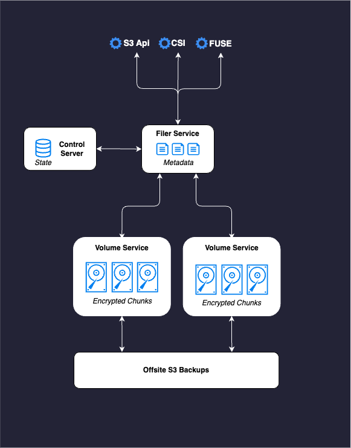

[SeaweedFS](https://github.com/seaweedfs/seaweedfs) is a fast distributed storage system for blobs, objects, files, and data lakes with a O(1) disk seek speeds. You can find out more about them by checking their [Wiki](https://github.com/seaweedfs/seaweedfs/wiki). 

Smol-k8s-lab uses SeaweedFS for creating isolated file-systems for apps like Postgres, Mastodon, and JuiceFS. This provides a consistent storage layer across applications that allows for uniform backup and restoration processes and high-speed local-storage. This data can easily be backed up to external storage via k8up. Check it out via our [SeaweedFS Argo CD Application](https://github.com/small-hack/argocd-apps/tree/main/seaweedfs).

## How it works

- The Volume Services chunk and encrypt data on-disk.
- The Filer Service tracks what data is stored where and answers queries about it.
- The Control Server keeps the state of all servers and keeps everything in sync

<p align="center">
  <a href="../../assets/images/seaweedfs.drawio.png">
      
  </a>
</p>

## Security

We enable encryption by default.

## Example config

```yaml
apps:
  seaweedfs:
    enabled: false
    description: |
      [link=https://github.com/seaweedfs/seaweedfs]seaweedfs[/link] is a filesystem with an exposable S3 endpoint.

      This is mostly meant to be for testing, but have at it :D

      If directory_recursion is set to true, we will also deploy the csi driver.
    init:
      enabled: true
      values:
        root_user: admin
    argo:
      # secrets keys to make available to Argo CD ApplicationSets
      secret_keys:
        hostname: ''
        s3_endpoint: 'seaweedfs.cooldogs.com'
        s3_region: eu-west-1
      # git repo to install the Argo CD app from
      repo: https://github.com/small-hack/argocd-apps
      # path in the argo repo to point to. Trailing slash very important!
      path: seaweedfs/app_of_apps/
      # either the branch or tag to point at in the argo repo above
      revision: main
      # namespace to install the k8s app in
      namespace: seaweedfs
      # recurse directories in the provided git repo
      # if set to false, we will not deploy the CSI driver
      directory_recursion: true
      # source repos for Argo CD App Project (in addition to argo.repo)
      project:
        name: seaweedfs
        source_repos:
        - https://seaweedfs.github.io/seaweedfs/helm
        - https://seaweedfs.github.io/seaweedfs-csi-driver/helm
        - https://github.com/seaweedfs/seaweedfs
        destination:
          # automatically includes the app's namespace and argocd's namespace
          namespaces: []
```
