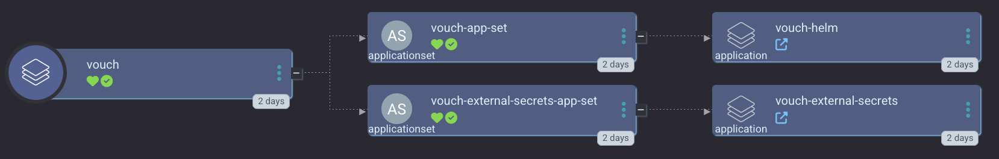

[vouch-proxy](https://github.com/vouch/vouch-proxy) is an SSO solution for Nginx using the auth_request module. Vouch Proxy can protect all of your websites at once.

`smol-k8s-lab` supports a custom initialization of Vouch using [Zitadel](/k8s_apps/zitadel.md).

<a href="../../assets/images/screenshots/vouch_screenshot.png">

</a>

Learn more about our:

- [Vouch helm chart fork](https://jessebot.github.io/vouch-helm-chart)
- [Vouch Argo CD Application](https://github.com/small-hack/argocd-apps/tree/main/vouch-proxy)


## Required Init Values
These values are required only if you're using the default smol-k8s-lab git repository for vouch.

- `domains` - these are all the domains that are allowed to be used behind vouch
- `emails` - these are all the email addresses that are allowed to view websites behind vouch

If you're using our default Argo CD ApplicationSet, you also need to pass in `hostname`.

## Example yaml config

Here's an example of a working vouch app config:

```yaml
apps:
  vouch:
    description: |
      [link=https://github.com/vouch/vouch-proxy]vouch-proxy[/link] can help you forward requests for OIDC authentication to any ingress source that doesn't already have it. Super useful for web pages like prometheus's UI.

      smol-k8s-lab supports the initialization of vouch if you also enable zitadel by creating OIDC applications and credentials and your vouch-proxy Kubernetes Secret.
    enabled: true
    # Initialization of the app through smol-k8s-lab using bitwarden and/or k8s secrets
    init:
      enabled: true
      values:
        # list of domains allowed to be behind vouch such as example.com
        domains: []
        # - example.com
        # email addresses allowed to authenticate via vouch
        emails: []
        # - beep@boop.com
    argo:
      # secrets keys to make available to Argo CD ApplicationSets
      secret_keys:
        # FQDN to use for vouch
        hostname: ""
      # repo to install the Argo CD app from
      # git repo to install the Argo CD app from
      repo: "https://github.com/small-hack/argocd-apps"
      # path in the argo repo to point to. Trailing slash very important!
      path: "vouch-proxy/app_of_apps/"
      # either the branch or tag to point at in the argo repo above
      revision: main
      # namespace to install the k8s app in
      namespace: "vouch"
      # recurse directories in the provided git repo
      directory_recursion: false
      # source repos for Argo CD App Project (in addition to argo.repo)
      project:
        source_repos:
          - https://jessebot.github.io/vouch-helm-chart
        destination:
          # automatically includes the app's namespace and argocd's namespace
          namespaces: []
```
