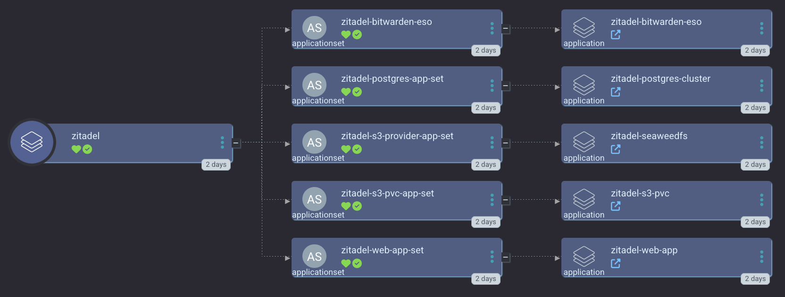

[Zitadel](https://zitadel.com/) is an Identity Management solution that includes acting as an OIDC provider.

<a href="../../assets/images/screenshots/zitadel_screenshot.png">

</a>

Zitadel is one of the more complex apps that `smol-k8s-lab` supports out of the box. For initialization, you need to pass in the following info:

- `username` - name of the first admin user to create
- `email` - email of the first admin user
- `first name` - first name of the first admin user
- `last name` - last name of the first admin user
- `gender` - optional - the gender of the first admin user

The above values are used to create an initial user. We also create Argo CD admin and users groups to be used with an Argo CD OIDC app that we prepare. If Vouch is enabled, we also create an OIDC app for that as well as a user group. You initial user is automatically added to all the groups we create.

Finally, we create a groupsClaim so that all queries for auth also process the user's groups.

In addition to those one time init values, we also require a hostname to use for the Zitadel API and web frontend.

## Sensitive values
You can provide the following values as environment variables:

- `ZITADEL_S3_BACKUP_ACCESS_ID`
- `ZITADEL_S3_BACKUP_SECRET_KEY`
- `ZITADEL_RESTIC_REPO_PASSWORD`

## Example config

```yaml
apps:
  zitadel:
    enabled: false
    description: |
      [link=https://zitadel.com/opensource]ZITADEL[/link] is an open source self hosted IAM platform for the cloud era

      smol-k8s-lab supports initialization of:
        - an admin service account
        - a human admin user (including an autogenerated password)
        - a project with a name of your chosing
        - 2 OIDC applications for Argo CD and Vouch
        - 2 Argo CD groups (admins and users), 1 vouch groups
        - groupsClaim action to enforce group roles on authentication
        - updates your appset_secret_plugin secret and refreshes the pod

      The default app will also deploy SeaweedFS to backup your database which in turn is backed up to a remote s3 provider of your choice.

      To provide sensitive values via environment variables to smol-k8s-lab use:
        - ZITADEL_S3_BACKUP_ACCESS_ID
        - ZITADEL_S3_BACKUP_SECRET_KEY
        - ZITADEL_RESTIC_REPO_PASSWORD
    init:
      # Switch to false if you don't want to create initial secrets or use the
      # API via a service account to create the above described resources
      enabled: true
      values:
        username: 'certainlynotadog'
        email: 'notadog@humans.com'
        first_name: 'Dogsy'
        last_name: 'Dogerton'
        # options: GENDER_UNSPECIFIED, GENDER_MALE, GENDER_FEMALE, GENDER_DIVERSE
        # more coming soon, see: https://github.com/zitadel/zitadel/issues/6355
        gender: GENDER_UNSPECIFIED
        # name of the default project to create OIDC applications in
        project: core
      sensitive_values:
        # sensitive values to provide via environment variables or via the TUI
        - S3_BACKUP_ACCESS_ID
        - S3_BACKUP_SECRET_KEY
        - RESTIC_REPO_PASSWORD
    argo:
      # secrets keys to make available to ArgoCD ApplicationSets
      secret_keys:
        # FQDN to use for zitadel
        hostname: 'zitadel.gooddogs.com'
        # type of database to use: postgresql or cockroachdb
        database_type: postgresql
        # set the local s3 provider for zitadel's database backups. can be minio or seaweedfs
        s3_provider: seaweedfs
        # local s3 endpoint for postgresql backups, backed up constantly
        s3_endpoint: 'zitadel-s3.gooddogs.com'
        # capacity for the PVC backing your local s3 instance
        s3_pvc_capacity: 2Gi
        # Remote S3 configuration, for pushing remote backups of your local postgresql backups
        # these are done only nightly right now, for speed and cost optimization
        s3_backup_endpoint: ''
        s3_backup_region: ''
        s3_backup_bucket: 'zitadel-backups'
      # repo to install the Argo CD app from
      # git repo to install the Argo CD app from
      repo: https://github.com/small-hack/argocd-apps
      # path in the argo repo to point to. Trailing slash very important!
      # if you want to use cockroachdb, change to zitadel/zitadel_and_cockroachdb
      path: zitadel/app_of_apps/
      # either the branch or tag to point at in the argo repo above
      ref: main
      # namespace to install the k8s app in
      namespace: zitadel
      # recurse directories in the provided git repo
      directory_recursion: false
      # source repos for Argo CD App Project (in addition to argo.repo)
      project:
        source_repos:
          - https://charts.zitadel.com
          - https://zitadel.github.io/zitadel-charts
          - https://small-hack.github.io/cloudnative-pg-cluster-chart
          - https://operator.min.io/
          - https://seaweedfs.github.io/seaweedfs/helm
        destination:
          namespaces: []
```

You can learn more about our Zitadel Argo CD Application at [small-hack/argocd-apps/zitadel](https://github.com/small-hack/argocd-apps/tree/main/zitadel).
