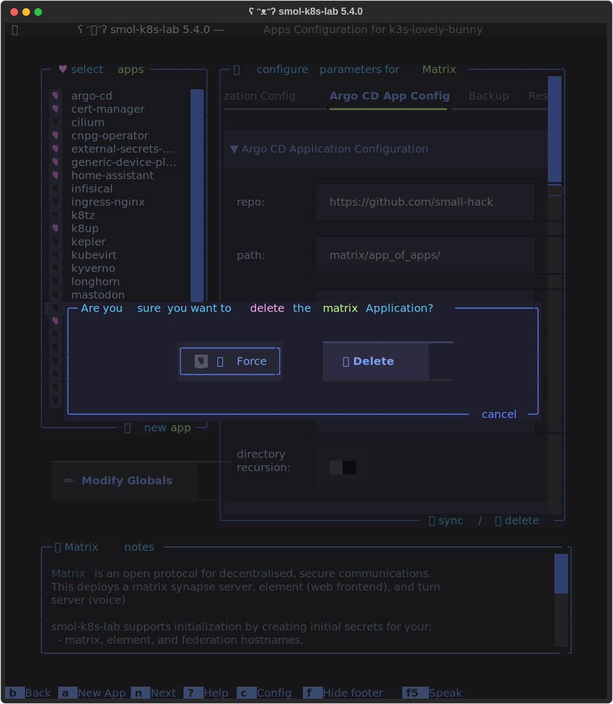
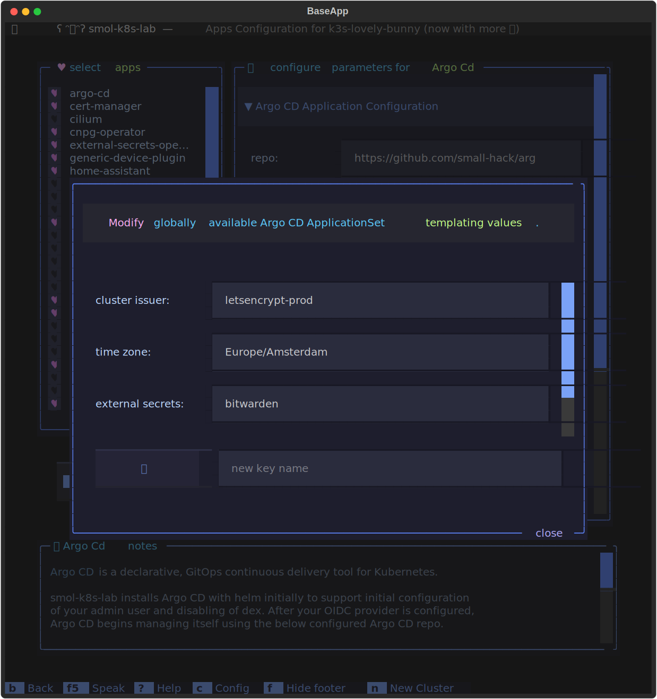
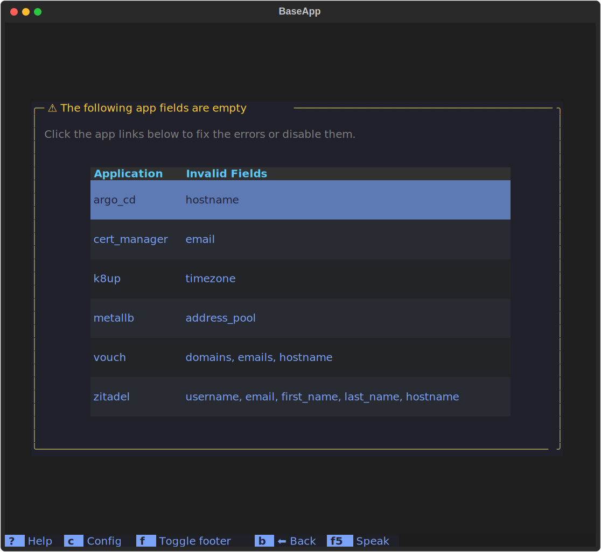

The TUI features an applications screen to modify or create new Argo CD Applications for your cluster.

[](../../assets/images/screenshots/apps_screen.svg)


## Selecting Applications

The left hand side [SelectionList] can be clicked or navigated using your arrow keys. To enable an app, you can either click it, or you can use the `spacebar` or `enter` keys. Only selected apps will be installed on your cluster.

## Modifying a simple or custom Application

To modify an application, ensure it's highlighted in the left hand list and then you can modify the parameters under each section described below:

### Argo CD Application Configuration

This section contains parameters to configure a [directory-type Argo CD Application](https://argo-cd.readthedocs.io/en/stable/user-guide/directory/) which includes:

| parameter             | description                                                                     |
|:----------------------|:--------------------------------------------------------------------------------|
| `repo`                | git repository to use for your Argo CD Application                              |
| `path`                | path in git repo to your kubernetes manifest files you'd like to deploy         |
| `revision`            | git branch or git tag to point to in the git repo                               |
| `cluster`             | Kubernetes cluster to deploy this Argo CD Application to                        |
| `namespace`           | Kubernetes namespace to deploy your Argo CD Application in                      |
| `directory_recursion` | Enabled recursive directory crawl of Argo CD repo for applying nested manifests |

### Template Values for Argo CD ApplicationSet

This section for modifying and/or adding values for this the currently selected `ApplicationSet` using the [appset secret plugin] to provide variables to the Argo CD Application at creation time.


### Argo CD Project Configuration

This section is for modifying the [Argo CD Project] parameters, which currently includes the following:

| parameter                 | description                                                        |
|:--------------------------|:-------------------------------------------------------------------|
| `name`                    | name of the Argo CD Project                                        |
| `destionation.namespaces` | namespaces that the Argo CD Applications are allowed to operate in |
| `source repos`            | allow list of repos that Argo CD applications can be sourced from  |

## Modifying an init-supported application

Some applications, such as nextcloud, matrix, and mastodon, support a special init phase for credentials creation, or restoration if backups are supported as well. When this is possible, you'll see a tabbed view for the configuration panel on the right hand side of the apps screen. It will include 4 tabs. We'll go through each below.

### Initialization Configuration
This phase includes setting up one time passwords in your password manager and in a kubernetes secret for credentials such as your admin credentials or SMTP credentials. To use the same name for an app without using our custom initialization process, please click the switch next to "Initialization Enabled" to set it to disabled. This will then treat this app as a normal custom app.

The values pictured in the screenshot below translate to the following YAML:
```yaml
apps:
  nextcloud:
    # initialize the app by setting up new k8s secrets and/or bitwarden items
    init:
      enabled: true
      values:
        # change the name of your admin user to whatever you like. This is used in an admin credentials k8s secret
        admin_user: my_nextcloud_admin
        smtp_user: my_smtp_nextcloud_username
        smtp_host: smtp-server.com
        # this value is taken from an environment variable
        smtp_password:
          value_from:
            env: NC_SMTP_PASSWORD
```

[](../../assets/images/screenshots/apps_screen_init.svg)

### Backups Configuration

Backups are done via k8up which is a wrapper around restic. For apps using cloud native postgres operator created clusters, we support both backup and restore of the database. For nextcloud specifically, we also put the database into maintainence mode. Here's an example of what you'll see in the TUI:

[](../../assets/images/screenshots/apps_screen_backups.svg)

For more on backups, see [Config File > Backups](/config_files/#backups).

### Restoring from Backup Configuration

To restore from a backup, you'll need to configure if you'd like to restore PVCs and the CNPG postgresql database or just the PVC. To do just the PVC set the "Restore 🐘 CNPG cluster enabled" switch to disabled by clicking it.

By default, we always use the latest restic snapshot ID to restore your cluster. If you'd like to use different snapshot IDs, please change the word "latest" for each PVC.


[](../../assets/images/screenshots/apps_screen_restores.svg)

For more on restores, see [Config File > Restores](/config_files/#restores).

### Deleting an Application

To delete an existing Argo CD Application, you can click the delete link at the bottom of the app configuration panel on the right. After you click it, you will see the following modal screen. If you click the checkbox next to word Force, you will pass in `--force` to the `argocd app delete` command when we run it. If/when you click the delete button, we will delete the app, associated appsets, and everything in the namespace.

[](../../assets/images/screenshots/delete_app_modal_screen.svg)


!!! Note
    The delete link will only be present if you're modifying an existing cluster, and the app is already present in Argo CD.

### Syncing an Application

To sync an existing Application, click the "sync" link at the bottom of the app configuration panel on the right.

!!! Note
    The sync link will only be present if you're modifying an existing cluster, and the app is already present in Argo CD.


## Adding new Applications

To add a new application, select the "✨ New App" button under the Select apps list, which will display this modal screen:

[](../../assets/images/screenshots/new_app_modal_screen.svg)

Enter a name for your app, and an optional description and select Submit. To cancel this action, you can either click the `cancel` link in the bottom border, or you can hit the `esc` key.


## Modifying Globally Available Templating Parameters for Argo CD ApplicationSets

To modify globally available templating parameters for *all* Argo CD ApplicationSets, select the second button the left hand side called "✏️  Modify Globals" which will launch a modal screen like this:

[](../../assets/images/screenshots/modify_global_parameters_modal_screen.svg)

To close this modal screen, you can either click the `close` link in the bottom border, or you can hit the `esc` key.


## Invalid Apps

If you have any Applications enabled that have invalid fields (empty fields), you'll see a screen like this:

[](../../assets/images/screenshots/invalid_apps_screen.svg)

To fix this, just click each app and either disable them by clicking the heart next app you don't want to use, or fill in any field that is empty, which should also be highlighted in pink.
