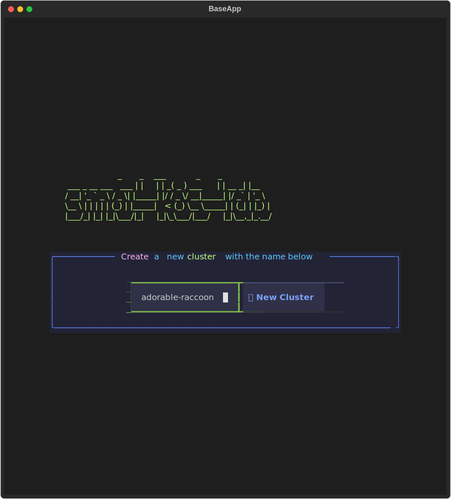

This will launch the TUI by default, which will guide you through how to proceed via a series of tooltips:

```bash
smol-k8s-lab
```

!!! Note
    More [accessibility features are on the roadmap](https://textual.textualize.io/roadmap/#features) for [textual](https://textual.textualize.io/) down the line, but please drop us a line if you'd like us to help with anything on our end in the meantime.


## Create a New Cluster

To create a new cluster, fill in the name of your cluster (or use the randomized pre-populated name) and either click the `submit` button, or if there is only one box on the screen, you can hit `enter`. If there are two boxes on the screen, and the input is not selected, you also use the `n` key (for new/next).

That will bring you to the [distro configuration](/distro_screen) screen to begin your configuration journey.

[](../../assets/images/screenshots/start_screen.svg)


## Modify or Delete a Kubernetes Cluster

The start screen will look like this:

[](../../assets/images/screenshots/start_screen_with_existing_clusters.svg)


The top section will only be present if you already have (a) Kubernetes cluster(s) in your [`$KUBECONFIG`](https://kubernetes.io/docs/concepts/configuration/organize-cluster-access-kubeconfig/#the-kubeconfig-environment-variable).


### Modify an Existing Cluster

To modify an existing cluster, select your cluster from the list of clusters (stored in a [DataTable](https://textual.textualize.io/widgets/data_table/)) in the top box.

!!! Note
    If you don't see a box with your clusters, the cluster is either not available in your `$KUBECONFIG`, not reachable, or you do not have any at this time.

You can use the `tab` key to scroll down the list of clusters and `shift`+`tab` to scroll up the list and then the `enter` key to select a cluster. You can also use your mouse to click on a cluster. After you select a cluster, you should see this "modal" (AKA pop-up) screen:

[](../../assets/images/screenshots/modify_cluster_modal_screen.svg)

To exit this screen, can either:

  - select one of the buttons (modify apps, modify nodes, or delete)
  - click the `cancel` link at the bottom of the modal border
  - press ++b++ or ++esc++


#### Delete an existing Cluster

To delete a cluster, you can either click the `Delete` button, or use your `tab` key to select it and then the `enter` key to press the button. Then, you will get another modal screen asking you to confirm the deletion. If you select the `yes` button, which is the first button, smol-k8s-lab will attempt to delete the cluster if it is one of the following distros: k3s, k3d, or kind.


[](../../assets/images/screenshots/delete_cluster_confirmation.svg)


#### Modify a Cluster's Apps

To modify a cluster's apps, from the start screen, select your cluster from the list in the first box, and then on the modal screen that appears, select the `modify apps` button. This will then automatically send you to the [apps config screen](/apps_screen) where you can modify or add applications to your cluster.

#### Modify a Cluster's Nodes (k3s only)

For k3s clusters, we support deleting nodes, or adding new nodes. To do this, fromt he start screen, select the cluster you'd like to modify from the list in the first box, and then on the modal screen that appears, select `Modify Nodes`. That will launch this screen:


[](../../assets/images/screenshots/modify_nodes_screen.svg)

There you can select a node by clicking on it or hitting the ++enter++ key. When you do that it will display another modal screen like this:
[](../../assets/images/screenshots/modify_node_modal_screen.svg)

You can select the modify or delete buttons to proceed. If you select delete you'll see this screen:
[](../../assets/images/screenshots/delete_node_confirm_modal_screen.svg)

To add a new node, just fill in the fields at the bottom and then hit ++ctrl++ + ++n++.
