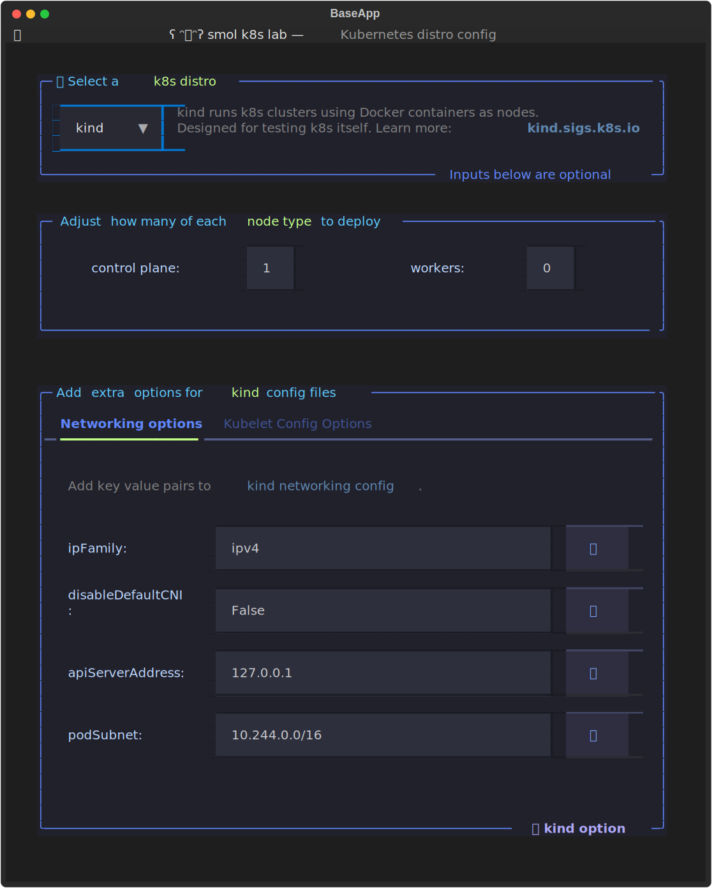

The "k8s distro config" screen is the first screen you will see in the TUI when creating a new cluster:

## Select Kubernetes Distro

To choose a distro, select one from the drop down [Select](https://textual.textualize.io/widgets/select/#select) in the first box. You can do this either with your mouse, or by hitting enter and then using the arrow keys to select a distro before hitting enter.

## Configuring control plane and worker nodes

If you're using `k3d` or `kind`, you can deploy clusters with more than one node. By default we will always deploy one control plane node, but you can adjust this number as well as how many workers we use.

## Extra options for k3s or k3d

If you're using k3d or k3s, you can adjust what [k3s options](https://docs.k3s.io/cli/server#k3s-server-cli-help) are passed into the [k3s config file](https://docs.k3s.io/installation/configuration#configuration-file).

## Extra options for kind

If you're using kind, you can modify both the networking and kubelet configuration options.

### Modify existing options

To modify an option, just change the text in any of the input boxes (you can click them, or navigate them with the `tab`/`shift`+`tab` keys).

!!! Note
    If you'd like to pass in multiple values for an option, use a comma separated list, e.g. disable: traefik, servicelb

To delete an option, use click the 🚮 button next to the input field.

### Add new options

To add a new option, you can click the "➕ k3s option" link at the bottom of the box, or you can use the `a` hot key. This will bring up a modal screen with an input field for the new option.

Enter the name of the new option you'd like to add.

!!! Note
    If you try to input an option that already exists, it will throw an error and make a bell sound. If you want to add an option that is already there, consider instead adding the extra values as a comma separated list.

!!! Tip
    To turn off bells, visit the [TUI config screen](/tui/tui_config.md)

## Add Nodes to k3s clusters (🆕 in v3.0)

The ability to other metal nodes to your cluster is exclusively to k3s in smol-k8s-lab. To add a new node in the TUI, make sure k3s is selected via the dropdown on the distro config screen. In the second box on the screen, there are three tabs, the final tab called "Add Remote Nodes" is the one you want to click. You can also use the left and right arrow keys to navigate the tabs.

Once there, you should see a list of any existing nodes you've added via your [config file](/config_file.md).

If you haven't added any clusters to your config file, you will see a random ascii art from a time in the past. The second half of the tab has a small form for you to add new nodes:

![terminal screenshot showing smol-k8s-lab's add remote nodes tab for the k3s distro config screen. At the top is a selection field for which distro you'd like to select. Below that is a box allowing you to customize nodes. The Add Remote Nodes tab is selcted. Within the tab it says 'Add a node below for something to appear here...' and then there is an ascii text art of little totoros fromt he movie My neighbor totoro by duke lee. Below that is a header that says Add a new node, and below that are a series of inputs and dropdowns for adding a new node. from left to right, starting at th e top, the fields are: host input, node type (drop down set to worker), ssh port input set to 22, ssh key input set to id_rsa, node label input, node taints input. At the bottom of the box is a link that says ➕ node. Below that is a footer that has hints on keys to press. It says control + N. key adds new, B is back, N is next, C is config, f is hide footer, and f5 is speak.](../../assets/images/screenshots/add_node_k3s_tab.svg)
